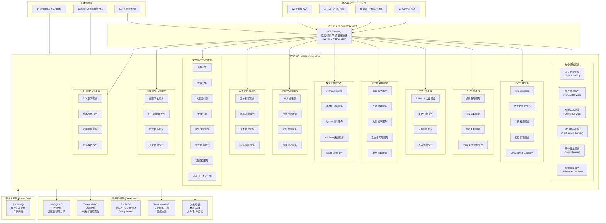
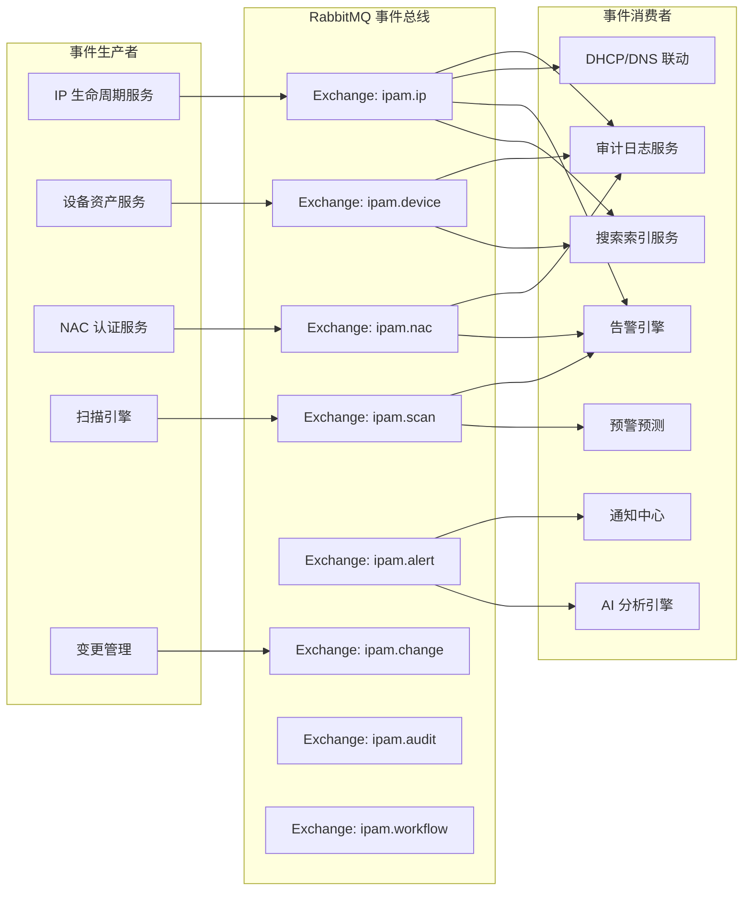
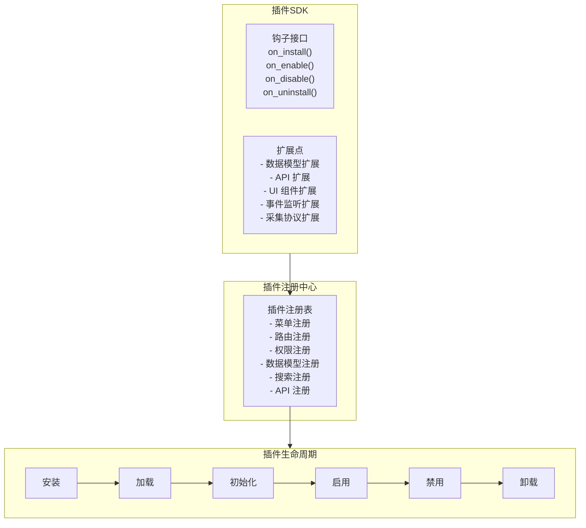
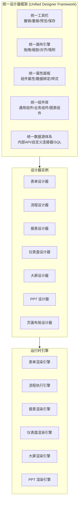
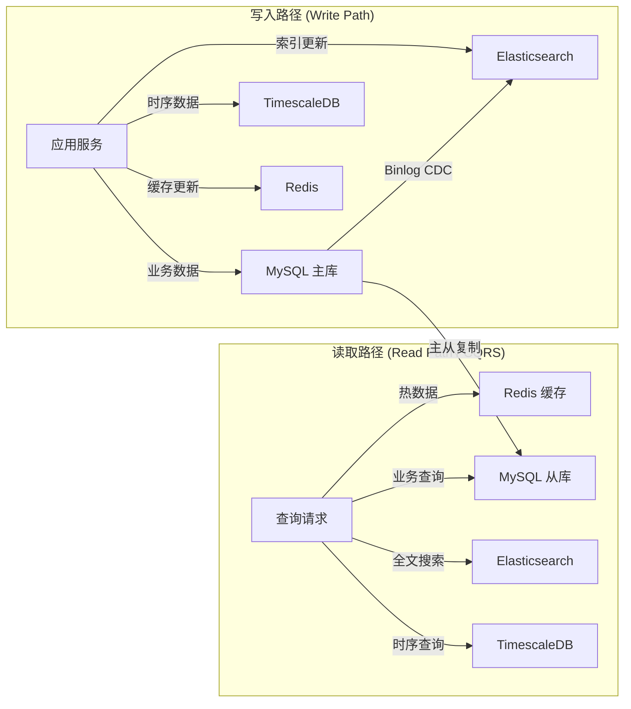
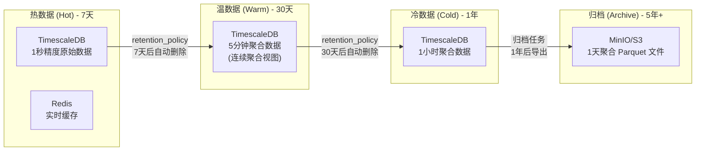
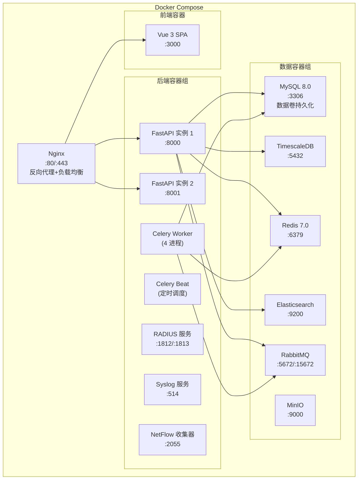

# 设计文档：IT 智维平台（低代码驱动的一体化 IT 运维管理平台）

## 概述

IT 智维平台是一个面向中大型企业的低代码驱动一体化 IT 运维管理平台，涵盖 15 个核心业务域：IPAM、DCIM、NAC、资产管理、终端管理、网络自动化、数据采集监控、AI 智能分析、工单 ITSM、低代码平台、安全合规、报表中心、IT 价值量化、运维协作、系统基础设施。

本设计采用**微服务 + 插件化 + 事件驱动**架构，以低代码引擎为底座，支持十万级 IP 资产管理、多租户隔离、分布式任务调度、数据生命周期管理和 AI 智能分析。

### 技术栈

| 层级 | 技术选型 |
|------|---------|
| 后端框架 | Python 3.11 + FastAPI + SQLAlchemy 2.0 + Celery |
| 前端框架 | Vue 3 + Element Plus + ECharts + AntV G6 + Fabric.js |
| 关系数据库 | MySQL 8.0（业务数据，InnoDB，支持分区表） |
| 时序数据库 | TimescaleDB（性能指标、流量数据、采集数据） |
| 缓存/队列 | Redis 7.0（缓存 + Celery Broker + 分布式锁） |
| 搜索引擎 | Elasticsearch 8.x（全文搜索、日志检索、智能搜索） |
| 消息队列 | RabbitMQ 3.12（事件总线、异步通信） |
| AI 引擎 | 多模型适配层（OpenAI/Azure/本地 LLM） |
| 容器化 | Docker Compose + Kubernetes |
| API 网关 | 自研网关层（限流/熔断/链路追踪） |


## 架构

### 系统逻辑分层图

```
┌─────────────────────────────────────────────────────────────────────────────┐
│                          接入层 (Access Layer)                               │
│  ┌──────────┐  ┌──────────┐  ┌──────────────┐  ┌──────────────┐           │
│  │ Vue 3 Web│  │移动端/小程│  │第三方 API 客户│  │ Webhook 入站 │           │
│  │  应用    │  │序/钉钉   │  │端 (Jenkins等)│  │              │           │
│  └────┬─────┘  └────┬─────┘  └──────┬───────┘  └──────┬───────┘           │
└───────┼──────────────┼───────────────┼─────────────────┼───────────────────┘
        │              │               │                 │
┌───────▼──────────────▼───────────────▼─────────────────▼───────────────────┐
│                      API 网关层 (Gateway Layer)                             │
│  ┌─────────┐ ┌─────────┐ ┌─────────┐ ┌─────────┐ ┌─────────┐ ┌────────┐ │
│  │链路追踪 │ │速率限制 │ │熔断降级 │ │JWT 认证 │ │RBAC 鉴权│ │租户隔离│ │
│  │TraceID  │ │Rate Limit│ │Circuit  │ │Token    │ │权限校验 │ │数据范围│ │
│  └─────────┘ └─────────┘ └─────────┘ └─────────┘ └─────────┘ └────────┘ │
└───────────────────────────────┬─────────────────────────────────────────────┘
                                │
┌───────────────────────────────▼─────────────────────────────────────────────┐
│                      微服务层 (Microservice Layer)                           │
│                                                                             │
│  ┌─ 核心基础 ──────────────────────────────────────────────────────────┐    │
│  │ 认证鉴权 │ 租户管理 │ 配置中心 │ 审计日志 │ 通知中心 │ 任务调度    │    │
│  └──────────────────────────────────────────────────────────────────────┘    │
│                                                                             │
│  ┌─ IPAM ──────┐ ┌─ DCIM ──────┐ ┌─ NAC ───────┐ ┌─ 资产管理 ────┐      │
│  │网段管理     │ │机房管理     │ │RADIUS 认证  │ │设备资产       │      │
│  │IP 生命周期  │ │机架管理     │ │策略引擎     │ │终端管理       │      │
│  │冲突检测     │ │线缆拓扑     │ │合规检查     │ │软件资产       │      │
│  │扫描引擎     │ │PDU/环境监控 │ │访客管理     │ │全生命周期     │      │
│  │DHCP/DNS联动 │ └─────────────┘ └─────────────┘ │盘点管理       │      │
│  └─────────────┘                                  └───────────────┘      │
│                                                                             │
│  ┌─ 数据采集 ──┐ ┌─ 智能分析 ──┐ ┌─ 工单协作 ──┐ ┌─ 低代码平台 ──┐      │
│  │多协议采集   │ │AI 分析引擎  │ │工单引擎     │ │表单引擎       │      │
│  │SNMP 采集    │ │预警预测     │ │流程引擎     │ │报表引擎       │      │
│  │Syslog 接收  │ │智能搜索     │ │SLA 管理     │ │仪表盘引擎     │      │
│  │NetFlow 采集 │ │指纹识别     │ │Helpdesk     │ │大屏/PPT 引擎  │      │
│  │Agent 管理   │ └─────────────┘ └─────────────┘ │插件/连接器    │      │
│  └─────────────┘                                  │自动化工作流   │      │
│                                                    └───────────────┘      │
│  ┌─ 网络自动化 ┐ ┌─ IT价值量化 ┐ ┌─ 运维协作 ──┐                        │
│  │配置下发     │ │ROI 计算     │ │知识库       │                        │
│  │ZTP 零配置   │ │成本分析     │ │值班排班     │                        │
│  │脚本模板     │ │效率量化     │ │Runbook 剧本 │                        │
│  │变更管理     │ │价值报告     │ │诊断工具     │                        │
│  └─────────────┘ └─────────────┘ │业务映射     │                        │
│                                   └─────────────┘                        │
└───────────────────────────────┬─────────────────────────────────────────────┘
                                │
┌───────────────────────────────▼─────────────────────────────────────────────┐
│                      事件总线层 (Event Bus - RabbitMQ)                       │
│                                                                             │
│  ┌──────────┐ ┌──────────┐ ┌──────────┐ ┌──────────┐ ┌──────────┐        │
│  │ipam.ip   │ │ipam.device│ │ipam.nac  │ │ipam.alert│ │ipam.audit│        │
│  │IP 事件   │ │设备事件   │ │准入事件  │ │告警事件  │ │审计事件  │        │
│  └──────────┘ └──────────┘ └──────────┘ └──────────┘ └──────────┘        │
│  ┌──────────┐ ┌──────────┐ ┌──────────┐                                   │
│  │ipam.scan │ │ipam.change│ │ipam.     │                                   │
│  │扫描事件  │ │变更事件   │ │workflow  │                                   │
│  └──────────┘ └──────────┘ └──────────┘                                   │
└───────────────────────────────┬─────────────────────────────────────────────┘
                                │
┌───────────────────────────────▼─────────────────────────────────────────────┐
│                      数据存储层 (Data Layer - CQRS)                          │
│                                                                             │
│  ┌─ 写入路径 ──────────────────────────────────────────────────────────┐    │
│  │                                                                     │    │
│  │  MySQL 8.0 主库          TimescaleDB           Redis 7.0           │    │
│  │  ┌──────────────┐       ┌──────────────┐      ┌──────────────┐    │    │
│  │  │业务数据      │       │时序数据      │      │缓存更新      │    │    │
│  │  │分区表/事务   │       │性能/流量/采集│      │会话/分布式锁 │    │    │
│  │  └──────────────┘       └──────────────┘      └──────────────┘    │    │
│  └─────────────────────────────────────────────────────────────────────┘    │
│                                                                             │
│  ┌─ 读取路径 ──────────────────────────────────────────────────────────┐    │
│  │                                                                     │    │
│  │  Redis 缓存(热数据)  MySQL 从库(业务查询)  ES 8.x(全文搜索/日志)  │    │
│  │  ┌──────────────┐   ┌──────────────┐      ┌──────────────┐        │    │
│  │  │TTL 5min      │   │主从复制      │      │全文检索      │        │    │
│  │  │Cache-Aside   │   │读写分离      │      │智能搜索      │        │    │
│  │  └──────────────┘   └──────────────┘      └──────────────┘        │    │
│  └─────────────────────────────────────────────────────────────────────┘    │
│                                                                             │
│  ┌─ 对象存储 ──────────────────────────────────────────────────────────┐    │
│  │  MinIO/S3: 文件上传 │ 配置备份 │ 冷数据归档 │ 固件库 │ PPT/报表   │    │
│  └─────────────────────────────────────────────────────────────────────┘    │
└─────────────────────────────────────────────────────────────────────────────┘

┌─────────────────────────────────────────────────────────────────────────────┐
│                      基础设施层 (Infrastructure)                             │
│  ┌──────────────┐  ┌──────────────┐  ┌──────────────┐  ┌──────────────┐   │
│  │Docker Compose│  │ Kubernetes   │  │Nginx 负载均衡│  │Prometheus    │   │
│  │/ K8s 编排    │  │ HPA 自动扩缩│  │TLS 终止      │  │+ Grafana 监控│   │
│  └──────────────┘  └──────────────┘  └──────────────┘  └──────────────┘   │
└─────────────────────────────────────────────────────────────────────────────┘
```

### 系统总体分层架构（Mermaid 版）



### 微服务拆分与模块边界

系统按 DDD（领域驱动设计）拆分为 15 个限界上下文，每个上下文对应一组微服务：

| 域 | 微服务 | 职责 | 覆盖需求 |
|----|--------|------|---------|
| 系统基础 | auth-service, tenant-service, config-service, audit-service, notification-service, scheduler-service | 认证鉴权、多租户、配置中心、审计日志、通知推送、任务调度 | 10,11,12,13,17,18,22,30,36,60,61,62,132,154,156,157 |
| IPAM | segment-service, ip-lifecycle-service, conflict-service, scan-service, dhcp-dns-service | 网段管理、IP 生命周期、冲突检测、Ping 扫描、DHCP/DNS 联动 | 1,2,4,5,9,20,21,50,51,52,67,70,73,111 |
| DCIM | datacenter-service, rack-service, cable-topology-service, pdu-env-service | 机房管理、机架管理、线缆拓扑、PDU/环境监控 | 31,32,33,34,35,47,163 |
| NAC | radius-service, policy-engine-service, compliance-service, visitor-service | RADIUS 认证、策略引擎、合规检查、访客管理 | 37,38,39,40,41,42,43,44,102,103,104,105,106 |
| 资产管理 | device-service, terminal-service, software-service, lifecycle-service, inventory-service | 设备资产、终端管理、软件资产、全生命周期、盘点管理 | 3,48,49,71,76,77,78,79,80,81,92,95,97,98,99,116,117,118,119,120,121,122,123,125,126,158 |
| 数据采集 | collector-engine, snmp-service, syslog-service, netflow-service, agent-service | 多协议采集引擎、SNMP/Syslog/NetFlow 采集、Agent 管理 | 83,84,85,86,87,149 |
| 监控展示 | performance-service, syslog-view-service, traffic-view-service, iot-view-service | 设备性能监控、日志分析、流量分析、工控/IoT 展示 | 88,89,90,91,93,110 |
| 智能分析 | ai-engine-service, prediction-service, search-service, fingerprint-service | AI 分析引擎、预警预测、智能搜索、指纹识别 | 59,94,152,155,161,167 |
| 工单协作 | ticket-service, workflow-engine-service, sla-service, helpdesk-service | 工单引擎、流程引擎、SLA 管理、Helpdesk | 45,64,65,66,96,100,108,113,114,135,136,137,138,139,141,142,143,144,145,146 |
| 低代码平台 | form-engine, report-engine, dashboard-engine, screen-engine, ppt-engine, plugin-service, connector-service, automation-service | 表单/报表/仪表盘/大屏/PPT 引擎、插件管理、连接器、自动化工作流 | 7,15,23,26,82,129,131,164,165,181 |
| 网络自动化 | netauto-service, ztp-service, script-service, change-service | 配置下发、ZTP、脚本模板、变更管理 | 19,46,124,133,134,140,159 |
| 数据治理 | cleaning-service, comparison-service, lifecycle-data-service | 数据清洗、数据源对比、数据生命周期 | 6,8,27,28,130,148,153,166 |
| 报表中心 | report-center-service | 统一报表中心、全模块报表 | 115 |
| IT 价值量化 | roi-service, cost-service, efficiency-service, value-report-service | ROI 计算、成本分析、效率量化、价值报告 | 109,169,171,172,173,174,175,176,177,178,179,180 |
| 运维协作 | knowledge-service, duty-service, runbook-service, diagnostic-service, business-mapping-service | 知识库、值班排班、Runbook、诊断工具、业务映射 | 58,74,75,101,107,112,127,128,147,160,162,168,170 |


## 组件与接口

### 事件驱动架构（EDA）

所有微服务通过 RabbitMQ 事件总线异步通信，实现模块间解耦。

#### 事件总线设计



#### 核心事件类型

| Exchange | Routing Key | 事件描述 | 消费者 | 优先级 |
|----------|-------------|---------|--------|--------|
| ipam.ip | ip.allocated | IP 地址已分配 | audit, dhcp-dns, search, alert | 高 |
| ipam.ip | ip.released | IP 地址已回收 | audit, dhcp-dns, search | 高 |
| ipam.ip | ip.conflict.detected | IP 冲突已检测到 | alert, notification, audit | 紧急 |
| ipam.ip | ip.status.changed | IP 状态变更 | audit, search, prediction | 中 |
| ipam.device | device.created | 设备已创建 | audit, search, topology | 中 |
| ipam.device | device.deleted | 设备已删除 | audit, search, ip-lifecycle, rack | 高 |
| ipam.device | device.config.changed | 设备配置变更 | audit, alert, backup | 高 |
| ipam.nac | nac.auth.success | 认证成功 | audit, terminal, ip-lifecycle | 高 |
| ipam.nac | nac.auth.failed | 认证失败 | audit, alert, security | 高 |
| ipam.nac | nac.violation.detected | 违规行为检测 | alert, notification, security | 紧急 |
| ipam.scan | scan.completed | 扫描完成 | alert, prediction, report | 低 |
| ipam.scan | scan.unregistered.found | 发现未注册设备 | alert, notification | 中 |
| ipam.alert | alert.triggered | 告警触发 | notification, sla, duty | 紧急 |
| ipam.alert | alert.resolved | 告警恢复 | notification, report | 中 |
| ipam.change | change.executed | 变更已执行 | audit, topology, verification | 高 |
| ipam.workflow | workflow.approved | 工单审批通过 | ip-lifecycle, device, automation | 高 |
| ipam.audit | audit.logged | 审计日志已记录 | elasticsearch, compliance | 低 |

#### 事件可靠性保障

```
消息可靠性设计：
├── 优先级队列 (Priority Queue)
│   ├── 紧急(10): 告警通知、冲突检测、违规封堵
│   ├── 高(7):   IP 分配/回收、配置下发、认证事件
│   ├── 中(5):   状态变更、搜索索引更新
│   └── 低(3):   日志归集、报表生成、扫描结果
│
├── 幂等性保障
│   ├── 每条消息携带唯一 message_id + idempotency_key
│   ├── 消费者基于 (resource_type + resource_id + version) 去重
│   └── Redis Set 存储已处理的 message_id (TTL 24h)
│
├── 消息积压防护
│   ├── 队列长度监控 → 超阈值告警
│   ├── 消费者自动扩缩容 (K8s HPA)
│   └── 非核心队列支持丢弃最旧消息 (x-max-length)
│
├── 顺序性保障
│   ├── 同一 IP 的事件路由到同一队列分区 (Consistent Hash Exchange)
│   └── 消费者单线程处理同一资源的事件序列
│
└── 死信处理
    ├── 重试 3 次后进入死信队列 (DLQ)
    ├── DLQ 消息人工审核或定时重试
    └── 超过 7 天未处理的 DLQ 消息告警
```

### API 网关设计

```python
# API 网关核心中间件栈
class APIGateway:
    """
    API 网关 - 所有请求的统一入口
    职责：限流、熔断、降级、链路追踪、JWT 验证、RBAC 鉴权
    """
    middleware_stack = [
        TraceIDMiddleware,       # 链路追踪 - 生成 TraceID
        RateLimitMiddleware,     # 限流 - 按 API Key/用户/IP 维度
        CircuitBreakerMiddleware,# 熔断 - 下游故障快速失败
        JWTAuthMiddleware,       # JWT 认证 - Token 验证
        RBACMiddleware,          # RBAC 鉴权 - 权限校验
        TenantIsolationMiddleware,# 租户隔离 - 数据范围限制
        AuditLogMiddleware,      # 审计日志 - 操作记录
        ResponseFormatMiddleware, # 统一响应格式
    ]
```

#### API 规范

所有 API 遵循 RESTful 规范，统一响应格式：

```json
{
    "code": 200,
    "message": "success",
    "data": {},
    "trace_id": "abc-123-def",
    "timestamp": "2026-01-01T00:00:00Z"
}
```

API 版本控制：`/api/v1/...`，路径规范：

| 资源 | 路径 | 方法 |
|------|------|------|
| 网段 | /api/v1/segments | GET, POST |
| 网段详情 | /api/v1/segments/{id} | GET, PUT, DELETE |
| IP 地址 | /api/v1/ips | GET, POST |
| IP 分配 | /api/v1/ips/allocate | POST |
| IP 批量分配 | /api/v1/ips/batch-allocate | POST |
| 设备 | /api/v1/devices | GET, POST |
| 终端 | /api/v1/terminals | GET, POST |
| 机房 | /api/v1/datacenters | GET, POST |
| 机架 | /api/v1/racks | GET, POST |
| VLAN | /api/v1/vlans | GET, POST |
| 工单 | /api/v1/tickets | GET, POST |
| 告警 | /api/v1/alerts | GET |
| 扫描任务 | /api/v1/scans | GET, POST |
| 报表 | /api/v1/reports | GET, POST |
| 仪表盘 | /api/v1/dashboards | GET, POST |

### 插件扩展机制



#### 插件接口定义

```python
class PluginBase(ABC):
    """插件基类 - 所有插件必须继承"""
    
    @abstractmethod
    def get_manifest(self) -> PluginManifest:
        """返回插件清单：名称、版本、依赖、注册信息"""
        pass
    
    @abstractmethod
    def on_install(self, context: PluginContext) -> None:
        """安装时执行：创建数据表、注册菜单/路由/权限"""
        pass
    
    @abstractmethod
    def on_enable(self, context: PluginContext) -> None:
        """启用时执行：注册事件监听、启动后台任务"""
        pass
    
    @abstractmethod
    def on_disable(self, context: PluginContext) -> None:
        """禁用时执行：注销事件监听、停止后台任务"""
        pass

class PluginManifest(BaseModel):
    name: str                    # 插件名称
    version: str                 # 版本号
    description: str             # 描述
    dependencies: list[str]      # 依赖的其他插件
    menus: list[MenuRegistration]     # 菜单注册
    routes: list[RouteRegistration]   # 路由注册
    permissions: list[PermRegistration] # 权限注册
    models: list[ModelRegistration]   # 数据模型注册
    apis: list[APIRegistration]       # API 注册
    search_indexes: list[SearchRegistration] # 搜索注册
```

### 低代码引擎架构



#### 设计器共享规范

所有设计器共享以下交互规范（需求 15.14, 129）：
- 拖拽手势：从左侧组件面板拖拽到中央画布
- 属性面板：右侧属性面板，选中组件后展示属性配置
- 快捷键：Ctrl+Z 撤销、Ctrl+Y 重做、Ctrl+S 保存、Ctrl+P 预览
- 模式切换：设计模式 ↔ 预览模式一键切换
- 模板入口：首次打开提供"从模板开始"和"从空白开始"
- 帮助向导：内置操作提示模式和案例参考侧边栏


## 数据模型

### 多数据库策略



### 分片与分页策略

#### ShardingSphere 分片规则（大规模部署）

当单表数据量超过 5000 万行时，启用 ShardingSphere-JDBC 分片：

| 表 | 分片键 | 分片策略 | 说明 |
|----|--------|---------|------|
| ip_addresses | tenant_id + ip_numeric | 按 tenant_id 分库，按 ip_numeric 范围分表 | 十万级 IP 场景 |
| audit_logs | tenant_id + created_at | 按 tenant_id 分库，按月分表 | 审计日志无限增长 |
| scan_results | task_id | 按 task_id 哈希分表 | 扫描结果量大 |
| ip_lifecycle_logs | tenant_id + created_at | 按 tenant_id 分库，按年分表 | 生命周期日志 |

#### 游标分页（Cursor-based Pagination）

所有大表查询强制使用游标分页，禁止 LIMIT offset：

```python
# 正确：游标分页（基于 ID 或时间戳）
SELECT * FROM ip_addresses 
WHERE tenant_id = ? AND id > ? 
ORDER BY id ASC LIMIT 50;

# 禁止：深分页（offset 大时全表扫描）
# SELECT * FROM ip_addresses LIMIT 50 OFFSET 1000000;
```

### 核心数据库表设计（MySQL）

#### 租户与权限域

```sql
-- 租户表
CREATE TABLE tenants (
    id BIGINT PRIMARY KEY AUTO_INCREMENT,
    name VARCHAR(100) NOT NULL,
    code VARCHAR(50) UNIQUE NOT NULL,
    status ENUM('active','disabled') DEFAULT 'active',
    config JSON,  -- 租户级配置
    created_at DATETIME DEFAULT CURRENT_TIMESTAMP,
    updated_at DATETIME DEFAULT CURRENT_TIMESTAMP ON UPDATE CURRENT_TIMESTAMP,
    INDEX idx_code (code),
    INDEX idx_status (status)
) ENGINE=InnoDB;

-- 用户表
CREATE TABLE users (
    id BIGINT PRIMARY KEY AUTO_INCREMENT,
    tenant_id BIGINT NOT NULL,
    username VARCHAR(100) NOT NULL,
    password_hash VARCHAR(255) NOT NULL,  -- bcrypt/Argon2
    display_name VARCHAR(100),
    email VARCHAR(200),
    phone VARCHAR(20),
    department VARCHAR(200),
    ldap_dn VARCHAR(500),  -- LDAP DN (若 LDAP 同步)
    status ENUM('active','disabled','locked') DEFAULT 'active',
    language ENUM('zh-CN','en-US') DEFAULT 'zh-CN',
    timezone VARCHAR(50) DEFAULT 'Asia/Shanghai',
    theme JSON,  -- 主题偏好
    last_login_at DATETIME,
    last_login_ip VARCHAR(45),
    created_at DATETIME DEFAULT CURRENT_TIMESTAMP,
    UNIQUE KEY uk_tenant_username (tenant_id, username),
    INDEX idx_tenant (tenant_id),
    INDEX idx_status (status),
    FOREIGN KEY (tenant_id) REFERENCES tenants(id)
) ENGINE=InnoDB;

-- 角色表
CREATE TABLE roles (
    id BIGINT PRIMARY KEY AUTO_INCREMENT,
    tenant_id BIGINT NOT NULL,
    name VARCHAR(100) NOT NULL,
    code VARCHAR(50) NOT NULL,
    is_system BOOLEAN DEFAULT FALSE,  -- 系统预定义角色不可删除
    parent_id BIGINT,  -- 角色继承
    permissions JSON,  -- 细粒度权限树 {"module.action": true}
    data_scope JSON,   -- 数据范围 {"segments": [...], "datacenters": [...]}
    valid_from DATETIME,
    valid_until DATETIME,  -- 权限有效期
    created_at DATETIME DEFAULT CURRENT_TIMESTAMP,
    UNIQUE KEY uk_tenant_code (tenant_id, code),
    FOREIGN KEY (tenant_id) REFERENCES tenants(id)
) ENGINE=InnoDB;

-- 用户角色关联表
CREATE TABLE user_roles (
    user_id BIGINT NOT NULL,
    role_id BIGINT NOT NULL,
    PRIMARY KEY (user_id, role_id),
    FOREIGN KEY (user_id) REFERENCES users(id),
    FOREIGN KEY (role_id) REFERENCES roles(id)
) ENGINE=InnoDB;
```

#### IPAM 域

```sql
-- 网段表（支持子网嵌套）
CREATE TABLE network_segments (
    id BIGINT PRIMARY KEY AUTO_INCREMENT,
    tenant_id BIGINT NOT NULL,
    cidr VARCHAR(43) NOT NULL,  -- CIDR 表示法
    network_address VARCHAR(39) NOT NULL,
    broadcast_address VARCHAR(39),
    prefix_length INT NOT NULL,
    ip_version TINYINT DEFAULT 4,
    parent_id BIGINT,  -- 父网段（子网嵌套）
    group_id BIGINT,   -- 所属分组
    vlan_id BIGINT,    -- 关联 VLAN
    description TEXT,
    business_group VARCHAR(200),
    total_ips INT NOT NULL,
    used_ips INT DEFAULT 0,
    reserved_ips INT DEFAULT 0,
    temporary_ips INT DEFAULT 0,
    usage_rate DECIMAL(5,2) DEFAULT 0.00,
    alert_threshold_warning INT DEFAULT 80,
    alert_threshold_critical INT DEFAULT 90,
    tags JSON,  -- 自定义标签
    custom_fields JSON,  -- 自定义字段
    status ENUM('active','archived') DEFAULT 'active',
    created_by BIGINT,
    created_at DATETIME DEFAULT CURRENT_TIMESTAMP,
    updated_at DATETIME DEFAULT CURRENT_TIMESTAMP ON UPDATE CURRENT_TIMESTAMP,
    deleted_at DATETIME,  -- 软删除
    version INT DEFAULT 1,  -- 乐观锁
    INDEX idx_tenant (tenant_id),
    INDEX idx_parent (parent_id),
    INDEX idx_cidr (cidr),
    INDEX idx_usage (usage_rate),
    INDEX idx_group (group_id),
    FOREIGN KEY (tenant_id) REFERENCES tenants(id),
    FOREIGN KEY (parent_id) REFERENCES network_segments(id)
) ENGINE=InnoDB;

-- 网段分组表
CREATE TABLE segment_groups (
    id BIGINT PRIMARY KEY AUTO_INCREMENT,
    tenant_id BIGINT NOT NULL,
    name VARCHAR(200) NOT NULL,
    parent_id BIGINT,  -- 分组嵌套
    description TEXT,
    sort_order INT DEFAULT 0,
    created_at DATETIME DEFAULT CURRENT_TIMESTAMP,
    INDEX idx_tenant (tenant_id),
    INDEX idx_parent (parent_id)
) ENGINE=InnoDB;

-- IP 地址表（核心表，支持分区，IPv4/IPv6 双栈）
CREATE TABLE ip_addresses (
    id BIGINT PRIMARY KEY AUTO_INCREMENT,
    tenant_id BIGINT NOT NULL,
    segment_id BIGINT NOT NULL,
    ip_address VARCHAR(39) NOT NULL,  -- 兼容 IPv4(15) 和 IPv6(39)
    ip_numeric BIGINT NOT NULL,  -- IPv4 数值（用于范围查询和排序）
    ip_numeric_high BIGINT DEFAULT 0,  -- IPv6 高 64 位（IPv6 扩展）
    ip_numeric_low BIGINT DEFAULT 0,   -- IPv6 低 64 位（IPv6 扩展）
    ip_version TINYINT DEFAULT 4,  -- 4=IPv4, 6=IPv6
    status ENUM('available','used','reserved','temporary') DEFAULT 'available',
    device_id BIGINT,
    terminal_id BIGINT,
    mac_address VARCHAR(17),
    hostname VARCHAR(255),
    responsible_person VARCHAR(100),
    department VARCHAR(200),
    allocation_reason TEXT,
    reservation_reason TEXT,
    reservation_expires_at DATETIME,
    temporary_expires_at DATETIME,
    dns_name VARCHAR(255),
    dhcp_lease_id BIGINT,
    geo_country VARCHAR(50),   -- GeoIP 国家
    geo_region VARCHAR(100),   -- GeoIP 省份/地区
    geo_isp VARCHAR(100),      -- GeoIP 运营商
    last_seen_at DATETIME,  -- 最后在线时间
    last_scan_at DATETIME,
    tags JSON,
    custom_fields JSON,
    allocated_at DATETIME,
    allocated_by BIGINT,
    released_at DATETIME,
    released_by BIGINT,
    created_at DATETIME DEFAULT CURRENT_TIMESTAMP,
    updated_at DATETIME DEFAULT CURRENT_TIMESTAMP ON UPDATE CURRENT_TIMESTAMP,
    deleted_at DATETIME,
    version INT DEFAULT 1,  -- 乐观锁
    idempotency_key VARCHAR(64),  -- 幂等键（防重复操作）
    UNIQUE KEY uk_tenant_ip (tenant_id, ip_address),
    INDEX idx_segment (segment_id),
    INDEX idx_status (status),
    INDEX idx_device (device_id),
    INDEX idx_mac (mac_address),
    INDEX idx_numeric (ip_numeric),
    INDEX idx_last_seen (last_seen_at),
    INDEX idx_geo (geo_country, geo_region),
    FOREIGN KEY (tenant_id) REFERENCES tenants(id),
    FOREIGN KEY (segment_id) REFERENCES network_segments(id)
) ENGINE=InnoDB
PARTITION BY RANGE (ip_numeric) (
    PARTITION p_10 VALUES LESS THAN (184549376),    -- 10.x.x.x
    PARTITION p_172 VALUES LESS THAN (2886729728),   -- 172.16-31.x.x
    PARTITION p_192 VALUES LESS THAN (3232301056),   -- 192.168.x.x
    PARTITION p_other VALUES LESS THAN MAXVALUE
);

-- IP 地址生命周期日志
CREATE TABLE ip_lifecycle_logs (
    id BIGINT PRIMARY KEY AUTO_INCREMENT,
    tenant_id BIGINT NOT NULL,
    ip_address_id BIGINT NOT NULL,
    ip_address VARCHAR(39) NOT NULL,
    action ENUM('allocate','release','reserve','unreserve','status_change','tag_change') NOT NULL,
    old_status VARCHAR(20),
    new_status VARCHAR(20),
    device_id BIGINT,
    operator_id BIGINT,
    operator_name VARCHAR(100),
    reason TEXT,
    details JSON,  -- 变更前后差异
    created_at DATETIME DEFAULT CURRENT_TIMESTAMP,
    INDEX idx_ip (ip_address_id),
    INDEX idx_tenant_time (tenant_id, created_at),
    INDEX idx_operator (operator_id)
) ENGINE=InnoDB
PARTITION BY RANGE (YEAR(created_at)) (
    PARTITION p2025 VALUES LESS THAN (2026),
    PARTITION p2026 VALUES LESS THAN (2027),
    PARTITION p2027 VALUES LESS THAN (2028),
    PARTITION pmax VALUES LESS THAN MAXVALUE
);

-- 冲突检测记录
CREATE TABLE conflict_records (
    id BIGINT PRIMARY KEY AUTO_INCREMENT,
    tenant_id BIGINT NOT NULL,
    ip_address VARCHAR(39) NOT NULL,
    conflict_type ENUM('logical','physical') NOT NULL,
    detection_method ENUM('ping','arp','dai') NOT NULL,
    conflicting_mac VARCHAR(17),
    conflicting_device VARCHAR(255),
    detection_time DATETIME NOT NULL,
    resolved BOOLEAN DEFAULT FALSE,
    resolved_at DATETIME,
    resolved_by BIGINT,
    details JSON,
    INDEX idx_tenant_ip (tenant_id, ip_address),
    INDEX idx_time (detection_time)
) ENGINE=InnoDB;

-- 扫描任务表
CREATE TABLE scan_tasks (
    id BIGINT PRIMARY KEY AUTO_INCREMENT,
    tenant_id BIGINT NOT NULL,
    name VARCHAR(200),
    scan_type ENUM('ping','arp','snmp') DEFAULT 'ping',
    segment_ids JSON,  -- 扫描的网段列表
    status ENUM('pending','running','paused','completed','failed') DEFAULT 'pending',
    concurrency INT DEFAULT 50,
    timeout_ms INT DEFAULT 3000,
    total_ips INT DEFAULT 0,
    scanned_ips INT DEFAULT 0,
    online_ips INT DEFAULT 0,
    offline_ips INT DEFAULT 0,
    unregistered_ips INT DEFAULT 0,
    started_at DATETIME,
    completed_at DATETIME,
    created_by BIGINT,
    schedule_cron VARCHAR(100),  -- 定时扫描 Cron 表达式
    INDEX idx_tenant (tenant_id),
    INDEX idx_status (status)
) ENGINE=InnoDB;

-- 扫描结果表
CREATE TABLE scan_results (
    id BIGINT PRIMARY KEY AUTO_INCREMENT,
    task_id BIGINT NOT NULL,
    ip_address VARCHAR(39) NOT NULL,
    status ENUM('online','offline','timeout') NOT NULL,
    response_time_ms INT,
    mac_address VARCHAR(17),
    is_registered BOOLEAN DEFAULT FALSE,
    device_id BIGINT,
    scanned_at DATETIME DEFAULT CURRENT_TIMESTAMP,
    INDEX idx_task (task_id),
    INDEX idx_ip (ip_address),
    INDEX idx_status (status),
    FOREIGN KEY (task_id) REFERENCES scan_tasks(id)
) ENGINE=InnoDB;
```

#### DCIM 域

```sql
-- 机房表
CREATE TABLE datacenters (
    id BIGINT PRIMARY KEY AUTO_INCREMENT,
    tenant_id BIGINT NOT NULL,
    name VARCHAR(200) NOT NULL,
    site_id BIGINT,  -- 站点
    building VARCHAR(200),
    floor VARCHAR(50),
    area_sqm DECIMAL(10,2),
    power_capacity_kw DECIMAL(10,2),
    geo_latitude DECIMAL(10,7),
    geo_longitude DECIMAL(10,7),
    address TEXT,
    floor_plan_url VARCHAR(500),  -- 平面图
    status ENUM('active','maintenance','decommissioned') DEFAULT 'active',
    custom_fields JSON,
    INDEX idx_tenant (tenant_id),
    INDEX idx_site (site_id)
) ENGINE=InnoDB;

-- 机架表（含三相电力模型）
CREATE TABLE racks (
    id BIGINT PRIMARY KEY AUTO_INCREMENT,
    tenant_id BIGINT NOT NULL,
    datacenter_id BIGINT NOT NULL,
    name VARCHAR(200) NOT NULL,
    total_units INT DEFAULT 42,  -- 总 U 数
    used_units INT DEFAULT 0,
    blanking_units INT DEFAULT 0,  -- 盲板占用 U 位
    rated_power_w INT,
    current_power_w INT DEFAULT 0,
    -- 三相电力模型（A/B/C Phase Balance）
    phase_a_current_a DECIMAL(6,2) DEFAULT 0,  -- A 相电流(安培)
    phase_b_current_a DECIMAL(6,2) DEFAULT 0,  -- B 相电流
    phase_c_current_a DECIMAL(6,2) DEFAULT 0,  -- C 相电流
    phase_max_current_a DECIMAL(6,2),  -- 单相最大电流
    phase_imbalance_threshold INT DEFAULT 20,  -- 三相不平衡度阈值(%)
    max_weight_kg DECIMAL(10,2),
    position_x INT,  -- 平面图坐标
    position_y INT,
    status ENUM('active','reserved','decommissioned') DEFAULT 'active',
    INDEX idx_tenant (tenant_id),
    INDEX idx_dc (datacenter_id),
    FOREIGN KEY (datacenter_id) REFERENCES datacenters(id)
) ENGINE=InnoDB;

-- 机架设备安装表（区分设备/盲板）
CREATE TABLE rack_installations (
    id BIGINT PRIMARY KEY AUTO_INCREMENT,
    rack_id BIGINT NOT NULL,
    device_id BIGINT,  -- NULL 表示盲板
    installation_type ENUM('device','blanking_plate') DEFAULT 'device',
    start_unit INT NOT NULL,  -- 起始 U 位
    unit_count INT NOT NULL,  -- 占用 U 数
    face ENUM('front','rear') DEFAULT 'front',
    pdu_port VARCHAR(50),  -- PDU 端口
    pdu_phase ENUM('A','B','C'),  -- 接入相位
    installed_at DATETIME DEFAULT CURRENT_TIMESTAMP,
    installed_by BIGINT,
    uninstalled_at DATETIME,
    INDEX idx_rack (rack_id),
    INDEX idx_device (device_id),
    FOREIGN KEY (rack_id) REFERENCES racks(id)
) ENGINE=InnoDB;

-- VLAN 表
CREATE TABLE vlans (
    id BIGINT PRIMARY KEY AUTO_INCREMENT,
    tenant_id BIGINT NOT NULL,
    vlan_id INT NOT NULL CHECK (vlan_id BETWEEN 1 AND 4094),
    name VARCHAR(200),
    description TEXT,
    group_name VARCHAR(200),
    status ENUM('active','disabled') DEFAULT 'active',
    UNIQUE KEY uk_tenant_vlan (tenant_id, vlan_id),
    INDEX idx_tenant (tenant_id)
) ENGINE=InnoDB;

-- 线缆连接表
CREATE TABLE cable_connections (
    id BIGINT PRIMARY KEY AUTO_INCREMENT,
    tenant_id BIGINT NOT NULL,
    cable_id VARCHAR(100),  -- 线缆编号
    cable_type ENUM('fiber','copper','dac') NOT NULL,
    cable_length_m DECIMAL(10,2),
    device_a_id BIGINT NOT NULL,
    port_a VARCHAR(100) NOT NULL,
    device_b_id BIGINT NOT NULL,
    port_b VARCHAR(100) NOT NULL,
    status ENUM('active','planned','disconnected') DEFAULT 'active',
    INDEX idx_device_a (device_a_id),
    INDEX idx_device_b (device_b_id)
) ENGINE=InnoDB;
```

#### 资产管理域

```sql
-- 设备资产表（统一资产表）
CREATE TABLE devices (
    id BIGINT PRIMARY KEY AUTO_INCREMENT,
    tenant_id BIGINT NOT NULL,
    asset_number VARCHAR(100) UNIQUE,  -- 资产编号
    name VARCHAR(200) NOT NULL,
    device_type ENUM('switch','router','firewall','ap','ac','server',
                     'terminal','printer','camera','sensor','pdu','ups','other') NOT NULL,
    category_id BIGINT,  -- 资产分类
    manufacturer VARCHAR(200),
    model VARCHAR(200),
    serial_number VARCHAR(200),
    mac_address VARCHAR(17),
    firmware_version VARCHAR(100),
    purchase_date DATE,
    warranty_expires DATE,
    purchase_price DECIMAL(12,2),
    current_value DECIMAL(12,2),  -- 当前净值（折旧后）
    depreciation_method ENUM('straight_line','double_declining','sum_of_years'),
    useful_life_years INT,
    responsible_person VARCHAR(100),
    department VARCHAR(200),
    location VARCHAR(500),
    datacenter_id BIGINT,
    rack_id BIGINT,
    lifecycle_status ENUM('purchasing','in_stock','in_use','maintenance',
                          'idle','decommissioned','scrapped') DEFAULT 'in_stock',
    images JSON,  -- 设备图片 URL 列表
    accessories JSON,  -- 配件信息
    tags JSON,
    custom_fields JSON,
    health_score INT DEFAULT 100,  -- 健康评分 0-100
    last_inspection_at DATETIME,
    created_at DATETIME DEFAULT CURRENT_TIMESTAMP,
    updated_at DATETIME DEFAULT CURRENT_TIMESTAMP ON UPDATE CURRENT_TIMESTAMP,
    deleted_at DATETIME,
    version INT DEFAULT 1,
    INDEX idx_tenant (tenant_id),
    INDEX idx_type (device_type),
    INDEX idx_mac (mac_address),
    INDEX idx_status (lifecycle_status),
    INDEX idx_category (category_id),
    INDEX idx_department (department),
    FULLTEXT INDEX ft_name_model (name, model, manufacturer)
) ENGINE=InnoDB;

-- 资产分类表
CREATE TABLE asset_categories (
    id BIGINT PRIMARY KEY AUTO_INCREMENT,
    tenant_id BIGINT NOT NULL,
    name VARCHAR(200) NOT NULL,
    parent_id BIGINT,
    level INT DEFAULT 1,
    field_template JSON,  -- 该分类的专属字段模板
    numbering_rule VARCHAR(200),  -- 编号规则
    INDEX idx_tenant (tenant_id),
    INDEX idx_parent (parent_id)
) ENGINE=InnoDB;

-- 资产流转记录表
CREATE TABLE asset_transfers (
    id BIGINT PRIMARY KEY AUTO_INCREMENT,
    device_id BIGINT NOT NULL,
    transfer_type ENUM('receive','issue','transfer','borrow','return','repair','scrap') NOT NULL,
    from_department VARCHAR(200),
    to_department VARCHAR(200),
    from_user VARCHAR(100),
    to_user VARCHAR(100),
    reason TEXT,
    ticket_id BIGINT,  -- 关联工单
    operator_id BIGINT,
    operated_at DATETIME DEFAULT CURRENT_TIMESTAMP,
    INDEX idx_device (device_id),
    INDEX idx_type (transfer_type)
) ENGINE=InnoDB;

-- 终端详情表
CREATE TABLE terminals (
    id BIGINT PRIMARY KEY AUTO_INCREMENT,
    device_id BIGINT NOT NULL,  -- 关联设备表
    tenant_id BIGINT NOT NULL,
    hostname VARCHAR(255),
    os_type VARCHAR(50),
    os_version VARCHAR(100),
    cpu_info VARCHAR(200),
    memory_gb DECIMAL(10,2),
    disk_info JSON,
    user_id BIGINT,  -- 使用人
    user_name VARCHAR(100),
    user_department VARCHAR(200),
    nac_status ENUM('compliant','non_compliant','quarantined','unknown') DEFAULT 'unknown',
    compliance_score INT DEFAULT 0,
    access_switch VARCHAR(200),
    access_port VARCHAR(100),
    access_vlan INT,
    online_status ENUM('online','offline','dormant') DEFAULT 'unknown',
    last_online_at DATETIME,
    fingerprint_type VARCHAR(100),  -- 指纹识别结果
    fingerprint_confidence ENUM('high','medium','low'),
    agent_version VARCHAR(50),
    agent_last_report_at DATETIME,
    tags JSON,
    INDEX idx_tenant (tenant_id),
    INDEX idx_device (device_id),
    INDEX idx_user (user_id),
    INDEX idx_online (online_status),
    INDEX idx_nac (nac_status)
) ENGINE=InnoDB;
```

#### 工单与流程域

```sql
-- 工单表
CREATE TABLE tickets (
    id BIGINT PRIMARY KEY AUTO_INCREMENT,
    tenant_id BIGINT NOT NULL,
    ticket_number VARCHAR(50) UNIQUE NOT NULL,
    title VARCHAR(500) NOT NULL,
    description TEXT,
    ticket_type ENUM('ip_request','device_request','permission_request',
                     'repair','change','incident','service_request') NOT NULL,
    priority ENUM('low','medium','high','urgent') DEFAULT 'medium',
    status ENUM('draft','submitted','in_review','approved','rejected',
                'executing','completed','closed') DEFAULT 'draft',
    workflow_id BIGINT,  -- 关联流程定义
    workflow_instance_id BIGINT,  -- 流程实例
    current_node_id BIGINT,
    applicant_id BIGINT NOT NULL,
    assignee_id BIGINT,
    form_data JSON,  -- 表单数据
    related_ips JSON,
    related_devices JSON,
    sla_deadline DATETIME,
    sla_status ENUM('normal','warning','breached') DEFAULT 'normal',
    satisfaction_score INT,  -- 满意度 1-5
    satisfaction_feedback TEXT,
    created_at DATETIME DEFAULT CURRENT_TIMESTAMP,
    updated_at DATETIME DEFAULT CURRENT_TIMESTAMP ON UPDATE CURRENT_TIMESTAMP,
    completed_at DATETIME,
    INDEX idx_tenant (tenant_id),
    INDEX idx_status (status),
    INDEX idx_type (ticket_type),
    INDEX idx_applicant (applicant_id),
    INDEX idx_assignee (assignee_id),
    INDEX idx_sla (sla_deadline)
) ENGINE=InnoDB;

-- 流程定义表
CREATE TABLE workflow_definitions (
    id BIGINT PRIMARY KEY AUTO_INCREMENT,
    tenant_id BIGINT NOT NULL,
    name VARCHAR(200) NOT NULL,
    category VARCHAR(100),
    definition JSON NOT NULL,  -- 流程节点和连线定义
    form_binding JSON,  -- 表单绑定配置
    version INT DEFAULT 1,
    status ENUM('draft','published','disabled') DEFAULT 'draft',
    created_by BIGINT,
    created_at DATETIME DEFAULT CURRENT_TIMESTAMP,
    INDEX idx_tenant (tenant_id),
    INDEX idx_category (category)
) ENGINE=InnoDB;

-- 流程实例表
CREATE TABLE workflow_instances (
    id BIGINT PRIMARY KEY AUTO_INCREMENT,
    definition_id BIGINT NOT NULL,
    definition_version INT NOT NULL,
    ticket_id BIGINT NOT NULL,
    current_node VARCHAR(100),
    status ENUM('running','completed','terminated','suspended') DEFAULT 'running',
    variables JSON,  -- 流程变量
    started_at DATETIME DEFAULT CURRENT_TIMESTAMP,
    completed_at DATETIME,
    INDEX idx_definition (definition_id),
    INDEX idx_ticket (ticket_id),
    INDEX idx_status (status)
) ENGINE=InnoDB;
```

#### 告警与通知域

```sql
-- 告警表
CREATE TABLE alerts (
    id BIGINT PRIMARY KEY AUTO_INCREMENT,
    tenant_id BIGINT NOT NULL,
    alert_type VARCHAR(100) NOT NULL,  -- segment_usage, device_offline, nac_violation...
    severity ENUM('info','warning','critical','emergency') NOT NULL,
    source_type VARCHAR(50),  -- segment, device, terminal, rack...
    source_id BIGINT,
    source_name VARCHAR(200),
    title VARCHAR(500) NOT NULL,
    description TEXT,
    is_prediction BOOLEAN DEFAULT FALSE,  -- 预警 vs 告警
    status ENUM('active','acknowledged','resolved','suppressed') DEFAULT 'active',
    acknowledged_by BIGINT,
    acknowledged_at DATETIME,
    resolved_at DATETIME,
    resolved_by BIGINT,
    resolution_note TEXT,
    escalation_level INT DEFAULT 0,
    suppressed_until DATETIME,
    root_cause_alert_id BIGINT,  -- 根因告警（告警风暴压缩）
    related_alert_count INT DEFAULT 0,
    auto_heal_status ENUM('none','executing','success','failed'),
    created_at DATETIME DEFAULT CURRENT_TIMESTAMP,
    INDEX idx_tenant (tenant_id),
    INDEX idx_type (alert_type),
    INDEX idx_severity (severity),
    INDEX idx_status (status),
    INDEX idx_source (source_type, source_id),
    INDEX idx_created (created_at),
    INDEX idx_root_cause (root_cause_alert_id)
) ENGINE=InnoDB
PARTITION BY RANGE (YEAR(created_at)) (
    PARTITION p2025 VALUES LESS THAN (2026),
    PARTITION p2026 VALUES LESS THAN (2027),
    PARTITION pmax VALUES LESS THAN MAXVALUE
);
```

#### 审计日志域

```sql
-- 操作审计日志表（不可篡改）
CREATE TABLE audit_logs (
    id BIGINT PRIMARY KEY AUTO_INCREMENT,
    tenant_id BIGINT NOT NULL,
    user_id BIGINT,
    user_name VARCHAR(100),
    user_role VARCHAR(100),
    action VARCHAR(100) NOT NULL,  -- create, update, delete, allocate, release...
    resource_type VARCHAR(50) NOT NULL,  -- ip, device, segment, ticket...
    resource_id BIGINT,
    resource_name VARCHAR(200),
    severity ENUM('normal','sensitive','critical') DEFAULT 'normal',
    details JSON,  -- 操作前后差异
    ip_address VARCHAR(45),
    user_agent VARCHAR(500),
    trace_id VARCHAR(100),
    hash_value VARCHAR(64),  -- SHA-256 哈希（防篡改）
    prev_hash VARCHAR(64),   -- 前一条日志哈希（链式校验）
    created_at DATETIME DEFAULT CURRENT_TIMESTAMP,
    INDEX idx_tenant_time (tenant_id, created_at),
    INDEX idx_user (user_id),
    INDEX idx_action (action),
    INDEX idx_resource (resource_type, resource_id),
    INDEX idx_severity (severity)
) ENGINE=InnoDB
PARTITION BY RANGE (YEAR(created_at)) (
    PARTITION p2025 VALUES LESS THAN (2026),
    PARTITION p2026 VALUES LESS THAN (2027),
    PARTITION pmax VALUES LESS THAN MAXVALUE
);
```

#### 低代码引擎域

```sql
-- 设计器配置表（统一存储所有设计器产物）
CREATE TABLE designer_configs (
    id BIGINT PRIMARY KEY AUTO_INCREMENT,
    tenant_id BIGINT NOT NULL,
    designer_type ENUM('form','workflow','report','dashboard','screen','ppt','page') NOT NULL,
    name VARCHAR(200) NOT NULL,
    category VARCHAR(100),
    config JSON NOT NULL,  -- 设计器配置（组件树、布局、数据绑定）
    is_template BOOLEAN DEFAULT FALSE,
    template_category VARCHAR(100),
    version INT DEFAULT 1,
    status ENUM('draft','published','disabled') DEFAULT 'draft',
    created_by BIGINT,
    created_at DATETIME DEFAULT CURRENT_TIMESTAMP,
    updated_at DATETIME DEFAULT CURRENT_TIMESTAMP ON UPDATE CURRENT_TIMESTAMP,
    INDEX idx_tenant (tenant_id),
    INDEX idx_type (designer_type),
    INDEX idx_template (is_template, template_category)
) ENGINE=InnoDB;

-- 自定义连接器表
CREATE TABLE custom_connectors (
    id BIGINT PRIMARY KEY AUTO_INCREMENT,
    tenant_id BIGINT NOT NULL,
    name VARCHAR(200) NOT NULL,
    connector_type ENUM('rest_api','database','ldap','smtp','wechat','dingtalk','feishu') NOT NULL,
    config JSON NOT NULL,  -- 连接配置（加密存储敏感字段）
    field_mapping JSON,  -- 字段映射
    cache_strategy JSON,  -- 缓存策略
    status ENUM('active','disabled','error') DEFAULT 'active',
    last_test_at DATETIME,
    last_test_result BOOLEAN,
    INDEX idx_tenant (tenant_id),
    INDEX idx_type (connector_type)
) ENGINE=InnoDB;

-- 自动化工作流表
CREATE TABLE automation_workflows (
    id BIGINT PRIMARY KEY AUTO_INCREMENT,
    tenant_id BIGINT NOT NULL,
    name VARCHAR(200) NOT NULL,
    trigger_type ENUM('data_change','schedule','webhook','alert','ticket_status') NOT NULL,
    trigger_config JSON NOT NULL,
    nodes JSON NOT NULL,  -- 流程节点定义
    status ENUM('active','disabled') DEFAULT 'active',
    version INT DEFAULT 1,
    last_triggered_at DATETIME,
    execution_count INT DEFAULT 0,
    INDEX idx_tenant (tenant_id),
    INDEX idx_trigger (trigger_type),
    INDEX idx_status (status)
) ENGINE=InnoDB;
```

### TimescaleDB 时序数据表

```sql
-- 设备性能指标（时序数据）
CREATE TABLE device_metrics (
    time TIMESTAMPTZ NOT NULL,
    device_id BIGINT NOT NULL,
    metric_name VARCHAR(100) NOT NULL,  -- cpu_usage, memory_usage, temperature...
    metric_value DOUBLE PRECISION NOT NULL,
    tags JSONB
);
SELECT create_hypertable('device_metrics', 'time');
-- 连续聚合：5 分钟聚合
CREATE MATERIALIZED VIEW device_metrics_5min
WITH (timescaledb.continuous) AS
SELECT time_bucket('5 minutes', time) AS bucket,
       device_id, metric_name,
       AVG(metric_value) AS avg_val,
       MAX(metric_value) AS max_val,
       MIN(metric_value) AS min_val
FROM device_metrics
GROUP BY bucket, device_id, metric_name;
-- 数据保留策略
SELECT add_retention_policy('device_metrics', INTERVAL '7 days');
SELECT add_retention_policy('device_metrics_5min', INTERVAL '30 days');

-- 端口流量数据
CREATE TABLE port_traffic (
    time TIMESTAMPTZ NOT NULL,
    device_id BIGINT NOT NULL,
    port_name VARCHAR(100) NOT NULL,
    in_octets BIGINT,
    out_octets BIGINT,
    in_packets BIGINT,
    out_packets BIGINT,
    bandwidth_utilization DOUBLE PRECISION
);
SELECT create_hypertable('port_traffic', 'time');

-- NetFlow 流量记录
CREATE TABLE netflow_records (
    time TIMESTAMPTZ NOT NULL,
    src_ip INET NOT NULL,
    dst_ip INET NOT NULL,
    src_port INT,
    dst_port INT,
    protocol INT,
    bytes BIGINT,
    packets BIGINT,
    duration_ms INT,
    application VARCHAR(100)
);
SELECT create_hypertable('netflow_records', 'time');
SELECT add_retention_policy('netflow_records', INTERVAL '30 days');
```

### Elasticsearch 索引设计

```json
// 全局搜索索引
{
  "ipam_global_search": {
    "mappings": {
      "properties": {
        "object_type": { "type": "keyword" },
        "object_id": { "type": "long" },
        "tenant_id": { "type": "long" },
        "title": { "type": "text", "analyzer": "ik_max_word" },
        "content": { "type": "text", "analyzer": "ik_max_word" },
        "ip_address": { "type": "ip" },
        "mac_address": { "type": "keyword" },
        "tags": { "type": "keyword" },
        "status": { "type": "keyword" },
        "department": { "type": "keyword" },
        "updated_at": { "type": "date" }
      }
    }
  }
}

// Syslog 日志索引（按月滚动）
{
  "syslog-YYYY-MM": {
    "mappings": {
      "properties": {
        "timestamp": { "type": "date" },
        "device_id": { "type": "long" },
        "device_ip": { "type": "ip" },
        "severity": { "type": "keyword" },
        "facility": { "type": "keyword" },
        "message": { "type": "text", "analyzer": "standard" },
        "parsed_fields": { "type": "object" }
      }
    }
  }
}
```


## 正确性属性

*正确性属性是一种在系统所有合法执行中都应成立的特征或行为——本质上是关于系统应该做什么的形式化陈述。属性是人类可读规范与机器可验证正确性保证之间的桥梁。*

### Property 1: CIDR 解析与网段-IP 关系一致性

*对于任意*合法 CIDR 字符串，解析后的网络地址、广播地址、可用 IP 总数应满足：total_ips = 2^(32-prefix_length) - 2（/31 和 /32 除外），且任意分配的 IP 地址的数值必须在 [network_address+1, broadcast_address-1] 范围内。对于任意非法 CIDR 字符串，解析应返回错误。

**验证需求: 1.1, 1.8, 2.1**

### Property 2: 网段使用率计算不变量

*对于任意*网段，used_ips + reserved_ips + temporary_ips + available_ips = total_ips 恒成立，且 usage_rate = (used_ips + reserved_ips + temporary_ips) / total_ips * 100。父网段的使用率应等于所有子网段使用量之和除以父网段总量。

**验证需求: 1.5, 1.6, 1.8**

### Property 3: IP 地址状态机合法性

*对于任意* IP 地址状态转换序列，状态只能在 {available, used, reserved, temporary} 之间按合法路径转换：available→used, available→reserved, available→temporary, used→available, reserved→available, temporary→available, temporary→used。任何非法状态转换应被拒绝。

**验证需求: 2.4**

### Property 4: 双重冲突检测一致性

*对于任意*已标记为 "used" 或 "reserved" 的 IP 地址，逻辑冲突检测应返回冲突。*对于任意*标记为 "available" 的 IP 地址，逻辑冲突检测应通过。冲突检测结果应与数据库状态一致。

**验证需求: 2.2, 4.1, 4.2, 4.5, 4.6**

### Property 5: MAC 地址格式验证

*对于任意*符合 IEEE 802 标准的 MAC 地址字符串（支持 XX:XX:XX:XX:XX:XX、XX-XX-XX-XX-XX-XX、XXXXXXXXXXXX 格式，大小写不敏感），验证函数应返回 true 并标准化为统一格式。*对于任意*不符合格式的字符串，应返回 false。

**验证需求: 3.2**

### Property 6: 审计日志链式完整性

*对于任意*审计日志序列，每条日志的 hash_value = SHA256(prev_hash + log_content)，且 prev_hash 等于前一条日志的 hash_value。验证任意子序列的链式哈希应能检测到篡改（插入、删除、修改任意一条日志都会导致后续所有哈希不匹配）。

**验证需求: 6.6**

### Property 7: JWT Token 生命周期 Round-Trip

*对于任意*有效用户，生成 JWT Token 后解码应返回相同的 user_id、role、tenant_id、permissions。Token 过期后解码应返回过期错误。刷新 Token 后，旧 Token 应立即失效（解码返回已吊销错误）。

**验证需求: 10.2, 10.3, 10.4, 10.5, 10.6**

### Property 8: RBAC 权限隔离

*对于任意*用户和操作组合，如果用户的角色权限树中不包含该操作的权限点，API 应返回 403。如果包含，应允许执行。权限继承应正确传递（子角色继承父角色权限）。

**验证需求: 11.1-11.6**

### Property 9: 多租户数据隔离

*对于任意*两个不同租户 A 和 B，租户 A 的 API 请求不应返回租户 B 的任何数据（网段、IP、设备、终端、工单、告警等）。跨租户资源访问应返回 404 或 403。

**验证需求: 22.1, 22.2, 22.3**

### Property 10: 事务原子性与回滚一致性

*对于任意*跨系统事务（如 IP 分配 + DHCP 下发 + DNS 创建），如果任意一步失败，所有已完成步骤应按逆序回滚，事务完成后系统状态应与事务开始前完全一致。*对于任意*成功事务，所有步骤的结果应持久化。

**验证需求: 13.2, 150.3, 156.1**

### Property 11: 机架 U 位空间不变量

*对于任意*机架，已安装设备占用的 U 位不应重叠（任意两个安装记录的 [start_unit, start_unit+unit_count-1] 区间不相交），且 used_units = 所有安装记录的 unit_count 之和，used_units ≤ total_units。

**验证需求: 32.3, 32.4, 32.5**

### Property 12: VLAN ID 唯一性不变量

*对于任意*租户，同一租户内不应存在两个相同的 VLAN ID。创建重复 VLAN ID 应被拒绝。

**验证需求: 34.2**

### Property 13: 工作流状态机正确性

*对于任意*流程定义和工单实例，流程应严格按定义的节点顺序流转。条件分支应根据工单数据正确匹配分支路径。并行分支应所有分支完成后才汇聚到下一节点。

**验证需求: 45.7, 45.8, 45.9**

### Property 14: 配置版本 Round-Trip

*对于任意*系统配置，修改配置后回滚到历史版本，配置值应与该历史版本完全一致。配置快照应完整记录所有字段值。

**验证需求: 60.3**

### Property 15: API 统一响应格式

*对于任意* API 端点的任意请求（成功或失败），响应 JSON 必须包含 code（整数）、message（字符串）、data（对象或 null）三个字段。错误响应的 code 应与 HTTP 状态码一致。

**验证需求: 14.3, 14.5**

### Property 16: API 速率限制

*对于任意* API 密钥，在配置的时间窗口内，超过频率限制的请求应返回 429 状态码。未超过限制的请求应正常处理。速率计数器在时间窗口结束后应重置。

**验证需求: 151.1**

### Property 17: 乐观锁并发安全

*对于任意*资源的两个并发修改请求（携带相同 version），只有一个应成功（version+1），另一个应收到版本冲突错误（409）。成功的修改应正确持久化。

**验证需求: 156.4**

### Property 18: 密码加密安全性

*对于任意*密码字符串，bcrypt/Argon2 加密后的哈希值应与原密码不同（不可逆），但验证函数 verify(password, hash) 应返回 true。*对于任意*不同密码，verify(wrong_password, hash) 应返回 false。

**验证需求: 18.1**

### Property 19: 数据降采样聚合一致性

*对于任意*时序数据集，5 分钟聚合的 AVG 值应等于该 5 分钟内所有原始数据点的算术平均值。MAX/MIN 值应等于该时间段内的实际最大/最小值。降采样不应丢失极值信息。

**验证需求: 148.1**

### Property 20: 告警风暴压缩正确性

*对于任意*告警序列，如果上游设备离线导致 N 台下游设备告警，压缩后应只展示 1 条根因告警，关联告警数量应为 N。根因恢复后，所有关联告警应自动恢复。

**验证需求: 161.1, 161.2, 161.3, 161.4**


## 错误处理

### 错误处理策略

| 层级 | 策略 | 实现 |
|------|------|------|
| API 网关层 | 统一异常捕获 + 标准错误响应 | FastAPI ExceptionHandler，所有异常转为 {code, message, data} 格式 |
| 业务服务层 | 领域异常 + 业务规则校验 | 自定义异常类（BusinessError, ValidationError, ConflictError） |
| 数据访问层 | 事务回滚 + 重试机制 | SQLAlchemy 事务管理，死锁自动重试（最多 3 次） |
| 外部集成层 | 熔断 + 降级 + 补偿 | Circuit Breaker 模式，失败操作进入补偿队列 |
| 异步任务层 | 重试 + 死信队列 | Celery 自动重试（指数退避），失败任务进入 DLQ |

### 错误码规范

```
错误码格式: XXYYYY
XX = 模块代码 (10=IPAM, 20=DCIM, 30=NAC, 40=资产, 50=工单, 60=系统)
YYYY = 错误序号

示例:
100001 - 网段 CIDR 格式无效
100002 - IP 地址逻辑冲突
100003 - IP 地址物理冲突
100004 - 网段使用率超阈值
200001 - 机架 U 位空间不足
200002 - 机架功率超限
300001 - RADIUS 认证失败
300002 - 终端合规检查不通过
400001 - MAC 地址格式无效
400002 - 资产编号重复
500001 - 工单流程节点配置错误
600001 - JWT Token 过期
600002 - 权限不足
600003 - 租户隔离违规
600004 - 版本冲突（乐观锁）
600005 - 速率限制超限
```

### 熔断降级机制

```python
class CircuitBreaker:
    """
    熔断器 - 保护下游系统
    状态: CLOSED(正常) -> OPEN(熔断) -> HALF_OPEN(探测恢复)
    """
    FAILURE_THRESHOLD = 5      # 连续失败 5 次触发熔断
    RECOVERY_TIMEOUT = 60      # 熔断 60 秒后进入半开状态
    HALF_OPEN_MAX_CALLS = 3    # 半开状态最多允许 3 个探测请求

    # 降级策略示例
    DEGRADATION_POLICIES = {
        "dhcp_sync": "local_only",      # DHCP 不可用时仅本地分配
        "dns_sync": "queue_retry",       # DNS 不可用时入队重试
        "switch_config": "queue_retry",  # 交换机不可用时入队重试
        "ai_analysis": "skip",           # AI 不可用时跳过分析
        "syslog_receive": "buffer",      # Syslog 不可用时本地缓冲
    }
```

### 分布式事务补偿

```python
class TransactionOrchestrator:
    """
    事务编排器 - 跨系统操作的 Saga 模式
    每个步骤定义: execute() + compensate()
    """
    # IP 分配事务示例
    IP_ALLOCATION_SAGA = [
        Step("allocate_ip",     execute=allocate_ip,     compensate=release_ip),
        Step("create_dhcp",     execute=create_dhcp,     compensate=delete_dhcp),
        Step("create_dns",      execute=create_dns,      compensate=delete_dns),
        Step("update_firewall", execute=update_fw_group,  compensate=revert_fw_group),
        Step("notify",          execute=send_notification, compensate=noop),
    ]
    # 任意步骤失败 -> 按逆序执行 compensate
```

## 测试策略

### 双轨测试方法

本系统采用**单元测试 + 属性测试**双轨并行的测试策略：

| 测试类型 | 工具 | 用途 | 最低迭代次数 |
|---------|------|------|-------------|
| 属性测试 | Hypothesis (Python) | 验证正确性属性（通用规则） | 100 次/属性 |
| 单元测试 | pytest | 验证具体示例、边界条件、错误处理 | - |
| 集成测试 | pytest + testcontainers | 验证跨服务交互、数据库操作 | - |
| API 测试 | pytest + httpx | 验证 API 契约、响应格式 | - |

### 属性测试配置

```python
# conftest.py
from hypothesis import settings, HealthCheck

settings.register_profile("ci", max_examples=200, suppress_health_check=[HealthCheck.too_slow])
settings.register_profile("dev", max_examples=100)
settings.load_profile("dev")
```

### 属性测试与设计属性映射

每个属性测试必须以注释引用设计文档中的属性编号：

```python
# Feature: ipam-system, Property 1: CIDR 解析与网段-IP 关系一致性
@given(cidr=valid_cidr_strategy())
def test_cidr_parsing_roundtrip(cidr):
    """Property 1: 合法 CIDR 解析后 total_ips 应正确计算"""
    segment = parse_cidr(cidr)
    prefix = segment.prefix_length
    if prefix < 31:
        assert segment.total_ips == 2 ** (32 - prefix) - 2
    # 任意生成的 IP 在范围内应属于该网段
    ...

# Feature: ipam-system, Property 7: JWT Token 生命周期 Round-Trip
@given(user=valid_user_strategy())
def test_jwt_roundtrip(user):
    """Property 7: Token 编码后解码应返回相同用户信息"""
    token = generate_jwt(user)
    decoded = decode_jwt(token)
    assert decoded.user_id == user.id
    assert decoded.role == user.role
    assert decoded.tenant_id == user.tenant_id
```

### 单元测试重点

单元测试聚焦以下场景（属性测试不覆盖的部分）：

- 边界条件：/32 网段、VLAN ID 1 和 4094、空网段删除
- 错误路径：无效输入、权限不足、资源不存在
- 集成点：DHCP/DNS 联动、交换机配置下发、RADIUS 认证
- 状态转换：IP 状态机非法转换、工单流程异常路径
- 并发场景：乐观锁冲突、分布式锁竞争

### 需求覆盖矩阵

| 属性编号 | 覆盖需求 | 测试类型 |
|---------|---------|---------|
| Property 1 | 1.1, 1.8, 2.1 | 属性测试 |
| Property 2 | 1.5, 1.6, 1.8 | 属性测试 |
| Property 3 | 2.4 | 属性测试 |
| Property 4 | 2.2, 4.1-4.6 | 属性测试 |
| Property 5 | 3.2 | 属性测试 |
| Property 6 | 6.6 | 属性测试 |
| Property 7 | 10.2-10.6 | 属性测试 |
| Property 8 | 11.1-11.6 | 属性测试 |
| Property 9 | 22.1-22.3 | 属性测试 |
| Property 10 | 13.2, 150.3, 156.1 | 属性测试 |
| Property 11 | 32.3-32.5 | 属性测试 |
| Property 12 | 34.2 | 属性测试 |
| Property 13 | 45.7-45.9 | 属性测试 |
| Property 14 | 60.3 | 属性测试 |
| Property 15 | 14.3, 14.5 | 属性测试 |
| Property 16 | 151.1 | 属性测试 |
| Property 17 | 156.4 | 属性测试 |
| Property 18 | 18.1 | 属性测试 |
| Property 19 | 148.1 | 属性测试 |
| Property 20 | 161.1-161.4 | 属性测试 |
| 需求 3-9, 19-21, 23-28 等 | 功能验证 | 单元测试 + 集成测试 |
| 需求 37-44 (NAC) | RADIUS 认证流程 | 集成测试 |
| 需求 83-93 (数据采集) | 协议采集正确性 | 集成测试 |
| 需求 7, 15, 82 (UI) | 前端交互 | E2E 测试 (Cypress) |


## 数据生命周期管理

### 冷热数据分层策略



### 各数据类型保留策略

| 数据类型 | 热数据 | 温数据 | 冷数据 | 归档 |
|---------|--------|--------|--------|------|
| 设备性能指标 | 7天(1秒) | 30天(5分钟) | 1年(1小时) | 5年(1天) |
| 端口流量 | 7天(1秒) | 30天(5分钟) | 1年(1小时) | 5年(1天) |
| NetFlow 流量 | 30天(原始) | - | 1年(1小时聚合) | 3年(1天) |
| Syslog 日志 | 90天(原始) | - | - | 2年(压缩) |
| 审计日志 | 永久(MySQL) | - | - | - |
| 扫描结果 | 90天 | - | - | 1年 |
| 配置备份 | 最近10版本 | - | - | 永久 |
| 告警记录 | 1年 | - | - | 5年 |

## 安全架构

### 安全分层

| 层级 | 安全措施 |
|------|---------|
| 传输层 | HTTPS/TLS 1.3 全链路加密，内部服务间 mTLS |
| 认证层 | JWT + Refresh Token，支持 LDAP/AD/企业微信 SSO，MFA 多因素认证 |
| 授权层 | RBAC + 数据范围控制，细粒度权限树，管理员层级 |
| 数据层 | 敏感字段 AES-256 加密存储，备份文件加密，日志脱敏 |
| 审计层 | 链式哈希审计日志，特权操作录屏，UEBA 行为分析 |
| 网络层 | API 速率限制，IP 白名单，WAF 防护 |
| 应用层 | 参数化查询防 SQL 注入，输入转义防 XSS，CSRF Token |

### 凭证管理

```
凭证保险库 (Vault)
├── 网络设备凭证 (SSH/Telnet/SNMP/Web)
│   ├── AES-256 加密存储
│   ├── 自动密码轮换 (90天周期)
│   └── 临时凭证申请 (审批+时效+录屏)
├── 数据库凭证
├── API 密钥
├── RADIUS 共享密钥
└── LDAP 绑定密码
```

## 部署架构

### Docker Compose 部署（单机/小规模）



### Kubernetes 部署（大规模/高可用）

```
K8s Namespace: ipam-system
├── Deployment: api-gateway (2+ replicas, HPA)
├── Deployment: ipam-service (2+ replicas)
├── Deployment: dcim-service (2+ replicas)
├── Deployment: nac-service (2+ replicas)
├── Deployment: asset-service (2+ replicas)
├── Deployment: collector-service (2+ replicas)
├── Deployment: ai-service (1+ replicas)
├── Deployment: ticket-service (2+ replicas)
├── Deployment: lowcode-service (2+ replicas)
├── Deployment: celery-worker (4+ replicas)
├── CronJob: celery-beat (1 replica)
├── StatefulSet: mysql (主从, 2 replicas)
├── StatefulSet: timescaledb (2 replicas)
├── StatefulSet: elasticsearch (3 replicas)
├── StatefulSet: rabbitmq (3 replicas, 镜像队列)
├── Deployment: redis-sentinel (3 replicas)
├── Deployment: minio (4 replicas, 纠删码)
├── Ingress: nginx-ingress (TLS termination)
└── ConfigMap/Secret: 配置和密钥
```

### 性能优化策略

| 优化维度 | 策略 | 实现 |
|---------|------|------|
| 数据库索引 | 核心查询字段建立复合索引 | tenant_id + 业务字段组合索引 |
| 分区表 | IP 地址表按 IP 数值范围分区，日志表按年分区 | MySQL RANGE 分区 |
| 分片 | 大表(>5000万行)启用 ShardingSphere 分片 | 按 tenant_id 分库，按业务键分表 |
| 游标分页 | 所有大表查询使用游标分页 | 基于 ID/时间戳的 WHERE id > cursor |
| 读写分离 | 写入走主库，读取走从库 + Redis 缓存 | CQRS 模式 |
| 缓存策略 | 热点数据 Redis 缓存，TTL 5分钟 | Cache-Aside 模式 |
| 搜索优化 | 全文搜索走 Elasticsearch，业务查询走 MySQL | 双写 + CDC 同步 |
| 自定义字段 | 高频字段虚拟生成列+索引，低频字段 JSON | 混合存储策略 |
| 批量操作 | 批量 INSERT/UPDATE 使用 executemany | SQLAlchemy bulk_insert |
| 连接池 | MySQL 连接池 20-50，Redis 连接池 10-20 | SQLAlchemy pool_size |
| 异步处理 | 耗时操作（扫描、报表、AI 分析）走 Celery 异步 | 优先级队列 |
| 降采样 | 时序数据自动降采样，减少存储和查询压力 | TimescaleDB 连续聚合 |
| Online DDL | 低代码表单结构变更使用 Online DDL | pt-online-schema-change / gh-ost |
| 会话缓存 | NAC 终端会话 Redis Hash 存储 | 毫秒级漫游切换 |


## 关键设计决策与最佳实践

### 架构决策记录

| 决策 | 选择 | 理由 | 替代方案 |
|------|------|------|---------|
| 微服务通信 | 事件驱动(RabbitMQ) + 同步 REST | 模块解耦，异步处理耗时操作，REST 用于实时查询 | gRPC（性能更高但生态不如 REST） |
| 数据库选型 | MySQL + TimescaleDB + ES | MySQL 成熟稳定适合业务数据，TimescaleDB 原生时序优化，ES 全文搜索 | PostgreSQL 单库（扩展性不足） |
| 大表分片 | ShardingSphere-JDBC | 单表超 5000 万行时按 tenant_id 分库、按业务键分表 | 仅 MySQL 分区（跨分区查询性能差） |
| 分页策略 | 游标分页(Cursor-based) | 避免深分页全表扫描，亿级数据稳定 O(1) | LIMIT offset（深分页性能雪崩） |
| 缓存策略 | Cache-Aside + TTL 5min | 简单可靠，适合读多写少场景，TTL 防止缓存雪崩 | Write-Through（一致性更强但复杂度高） |
| 认证方案 | JWT RS256 + Refresh Token | 无状态扩展性好，RS256 支持公钥验证 | Session（有状态，不适合微服务） |
| 任务调度 | Celery + Redis Broker | Python 生态成熟，支持优先级队列和定时任务 | APScheduler（不支持分布式） |
| 前端框架 | Vue 3 + Element Plus | 组件丰富，中文生态好，适合企业后台 | React（生态更大但学习曲线陡） |
| 低代码引擎 | 自研统一设计器框架 | 7 种设计器共享交互规范和组件库，降低用户学习成本 | 集成第三方低代码（定制性不足） |
| 多租户隔离 | 共享数据库 + 行级隔离(tenant_id) | 运维简单，适合中等租户数量 | 独立数据库（隔离性更强但运维复杂） |
| 对象存储 | MinIO（自托管 S3 兼容） | 私有化部署，S3 API 兼容，后续可迁移至云 S3 | 本地文件系统（不支持分布式） |
| 消息优先级 | RabbitMQ Priority Queue | 告警/配置下发优先于日志/报表，防止非核心任务阻塞核心链路 | 单一队列（告警延迟风险） |

### 扩展性设计要点

1. **水平扩展**：所有微服务无状态设计，通过 K8s HPA 自动扩缩容，数据库读写分离支持读扩展
2. **垂直扩展**：ShardingSphere 分片支持单表亿级数据，TimescaleDB 连续聚合自动降采样
3. **插件扩展**：新功能模块通过插件 SDK 接入，无需修改核心代码，支持热加载
4. **协议扩展**：数据采集引擎支持 15+ 协议，新协议通过插件机制添加
5. **数据源扩展**：自定义连接器支持 REST API/数据库/LDAP 等外部数据源接入
6. **IPv6 双栈就绪**：IP 地址字段 VARCHAR(39) 兼容 IPv6，ip_numeric_high/low 双字段存储 128 位 IPv6 地址，支持 IPv6 /64 规划校验、EUI-64 自动生成、IPv4/IPv6 双栈共存视图
7. **GeoIP 集成**：集成 MaxMind GeoIP 库，IP 分配时自动标记国家/省份/ISP，支持跨境合规审计

### 数据一致性保障

```
本地事务 (ACID)
├── 单服务内操作 → MySQL 事务 + 乐观锁(version 字段)
├── 并发控制 → Redis 分布式锁(Redlock) + 数据库行锁
├── 幂等设计 → 所有异步操作携带唯一 idempotency_key
└── 跨数据库一致性 → MySQL 与 TimescaleDB 通过事件补偿保证最终一致

跨服务事务 (最终一致性)
├── Saga 编排模式 → TransactionOrchestrator 管理步骤+补偿
├── 事件溯源 → RabbitMQ 事件 + 死信队列(DLQ) + 重试
├── 补偿队列 → 失败操作入队，定时重试，超限告警
└── 跨库补偿 → IP 分配(MySQL)失败时自动回滚 TimescaleDB 中的关联指标记录
```

### 低代码引擎性能优化

```
自定义字段存储策略（混合模式）：
├── 热数据（高频查询字段）
│   ├── 宽表存储：核心字段直接建列（name, status, type 等）
│   ├── 支持索引和 WHERE 查询
│   └── 通过 Online DDL 动态添加列（不锁表）
│
├── 温数据（自定义字段）
│   ├── JSON 列存储：custom_fields JSON
│   ├── MySQL 8.0 JSON 函数查询：JSON_EXTRACT(custom_fields, '$.field_a')
│   ├── 虚拟生成列 + 索引：高频自定义字段自动创建虚拟列
│   └── ALTER TABLE ADD COLUMN field_a VARCHAR(200) 
│       GENERATED ALWAYS AS (JSON_UNQUOTE(JSON_EXTRACT(custom_fields, '$.field_a'))) VIRTUAL,
│       ADD INDEX idx_field_a (field_a);
│
└── 冷数据（历史归档）
    ├── 完全扁平化存入 ES（支持任意字段搜索）
    └── Parquet 格式归档至 MinIO
```

### 特权账号管理（PAM 金库模式）

```
特权操作安全模型：
├── 日常操作 → 标准 RBAC 权限控制
│
├── 高危操作（删除网段/批量回收/配置下发/核心配置修改）
│   ├── 1. 申请"金库钥匙"（提交申请+审批）
│   ├── 2. 获取临时提权（有效期 30 分钟，可配置）
│   ├── 3. 执行操作（全程录屏 + 审计日志）
│   ├── 4. 操作完成后权限自动回收
│   └── 5. 超时未使用自动失效
│
├── 紧急操作（系统故障/安全事件）
│   ├── Break Glass 模式：跳过审批直接提权
│   ├── 事后补审批 + 强制复盘
│   └── 所有 Break Glass 操作红色高亮审计
│
└── 设备凭证管理
    ├── 凭证保险库 AES-256 加密存储
    ├── 自动密码轮换（90 天周期）
    ├── 临时凭证申请（审批+时效+录屏）
    └── 非授权使用检测（非 IPAM 发起的 SSH 登录自动告警）
```

### NAC 无线漫游与会话管理

```
实时会话管理（Redis）：
├── 会话表结构：Hash key = "nac:session:{mac_address}"
│   ├── user_id, username, department
│   ├── ip_address, vlan_id
│   ├── access_device (交换机/AP), access_port
│   ├── auth_method (802.1X/Portal/MAC/PPSK)
│   ├── auth_time, session_start
│   └── compliance_status
│
├── 漫游处理（毫秒级）
│   ├── 终端连接新 AP → 更新 Redis 会话的 access_device/port
│   ├── 通知旧 AP 释放会话（CoA Disconnect）
│   └── 认证状态继承，无需重新认证
│
├── 访客短信风控
│   ├── 同一手机号：60 秒内最多 1 条，24 小时最多 5 条
│   ├── 同一 IP：60 秒内最多 3 条
│   ├── 图形验证码前置（防机器刷）
│   └── 异常频率自动拉黑 IP/手机号
│
└── AI Copilot 集成
    ├── 高危操作前 AI 自动生成影响报告
    ├── 故障排查时 AI 推荐处理方案 + 一键执行
    ├── 自然语言运维："帮我找上周五下架的数据库服务器"
    └── 配置变更时 AI 自动生成变更摘要和风险评估
```

## 需求设计映射

### 需求到微服务/组件映射总表

| 需求 | 标题 | 主服务 | 数据存储 | 关键设计决策 |
|------|------|--------|---------|-------------|
| 1 | 网段管理 | segment-service | MySQL(network_segments, segment_groups) | 子网嵌套用 parent_id 树形结构，CIDR 解析用 ipaddress 库 |
| 2 | IP 地址生命周期 | ip-lifecycle-service | MySQL(ip_addresses, ip_lifecycle_logs) | 状态机模式管理四种状态，临时 IP 用 Celery 定时检查过期 |
| 3 | 设备资产管理 | device-service | MySQL(devices, asset_transfers) | 统一设备表 + 分类字段模板，逻辑删除支持恢复 |
| 4 | 双重冲突检测 | conflict-service | MySQL(conflict_records), Redis(锁) | 先逻辑检测(DB查询)再物理检测(Ping/ARP)，分布式锁防并发 |
| 5 | IP Ping 扫描 | scan-service | MySQL(scan_tasks, scan_results) | Celery 异步任务，asyncio 并发 Ping，WebSocket 推送进度 |
| 6 | 操作日志 | audit-service | MySQL(audit_logs), ES | 链式哈希防篡改，CDC 同步到 ES 支持全文搜索 |
| 7 | 数据可视化 | dashboard-engine | MySQL(designer_configs) | 统一设计器框架，ECharts 渲染，数据源可视化绑定 |
| 8 | Excel 导入导出 | ip-lifecycle/device-service | MySQL, MinIO(文件) | openpyxl 处理，Celery 异步导入，部分导入+错误报告 |
| 9 | 网段使用率告警 | alert-engine | MySQL(alerts), Redis(抑制计数) | 多级阈值，告警升级用 Celery 延时任务，抑制用 Redis TTL |
| 10 | JWT 鉴权 | auth-service | Redis(Token 黑名单) | RS256 签名，Refresh Token 机制，Token 吊销用 Redis Set |
| 11 | RBAC 权限 | auth-service | MySQL(roles, user_roles) | 权限树 JSON 存储，角色继承，数据范围控制 |
| 12 | 系统部署 | 基础设施 | Docker/K8s | Docker Compose + K8s 双模式，环境变量配置 |
| 13 | 数据持久化 | 基础设施 | MySQL(主从), MinIO(备份) | 事务保证原子性，增量备份用 mysqlbinlog |
| 14 | API 设计 | api-gateway | - | RESTful + OpenAPI 3.0，统一响应格式，版本控制 |
| 15 | 前端界面 | Vue 3 前端 | - | Element Plus + 低代码布局编辑器，统一设计器框架 |
| 16 | 性能可扩展 | 全局 | 分区表, Redis缓存 | 索引优化，CQRS 读写分离，连接池 |
| 17 | 错误处理 | 全局 | 日志文件, ES | 结构化日志，loguru，日志轮转 |
| 18 | 安全性 | auth-service, api-gateway | - | bcrypt 密码，参数化查询，速率限制 |
| 19 | 网络设备集成 | device-service, collector | MySQL, TimescaleDB | SSH/SNMP 采集，Netmiko 库，配置备份版本管理 |
| 20 | DHCP/DNS 联动 | dhcp-dns-service | MySQL | 事件驱动：IP 分配事件触发 DHCP/DNS 同步 |
| 21 | 智能 IP 分配 | ip-lifecycle-service | MySQL, Redis | 连续空闲 IP 算法，预留段管理，模板批量创建 |
| 22 | 多租户隔离 | tenant-service | MySQL(tenants) | 行级租户隔离(tenant_id)，中间件自动注入 |
| 23 | 合规审计报表 | report-engine | MySQL, MinIO | 拖拽式报表设计器，参数化查询，定时推送 |
| 24 | CMDB/监控集成 | connector-service | MySQL | REST API 双向同步，Webhook 告警接收 |
| 25 | API 与 Webhook | api-gateway, connector | MySQL, Redis | API Key 管理，Webhook 事件配置，签名验证 |
| 26 | 自定义字段表单 | form-engine | MySQL(designer_configs) | 拖拽式表单设计器，字段联动规则引擎，校验规则引擎 |
| 27 | 数据清洗 | cleaning-service | MySQL | Celery 定时任务，清洗前自动快照，一键修复 |
| 28 | 容量规划 | prediction-service | MySQL, TimescaleDB | 线性回归预测耗尽时间，模拟扩容 |
| 29 | 高可用集群 | 基础设施 | MySQL主从, Redis Sentinel | Nginx 负载均衡，健康检查自动重启 |
| 30 | LDAP 认证 | auth-service | MySQL, LDAP | python-ldap 库，混合认证降级，定时同步 |
| 31 | 机房管理 | datacenter-service | MySQL(datacenters) | 层级结构(站点>建筑>楼层>机房)，平面图 MinIO 存储 |
| 32 | 机架管理 | rack-service | MySQL(racks, rack_installations) | U 位可视化，空间/功率双重校验 |
| 33 | 设备上下架 | rack-service | MySQL(rack_installations) | 批量上架，PDU 端口关联，位置历史记录 |
| 34 | VLAN 管理 | segment-service | MySQL(vlans) | VLAN-网段-端口三方关联，唯一性校验 |
| 35 | 网络拓扑线缆 | cable-topology-service | MySQL(cable_connections), ES | LLDP/CDP 自动发现，AntV G6 拓扑渲染，故障影响域分析 |
| 36 | 统一通知中心 | notification-service | MySQL, Redis | 多渠道(邮件/企微/钉钉)，模板引擎，发送状态追踪 |
| 37 | NAC 认证管理 | radius-service | MySQL, Redis | 内置 FreeRADIUS，802.1X/Portal/MAC/PPSK 四种模式 |
| 38 | 终端合规检查 | compliance-service | MySQL | 合规检查项引擎，VLAN 动态切换，CoA 授权变更 |
| 39 | 华为设备纳管 | collector, netauto-service | MySQL, TimescaleDB | SSH/SNMP 自动发现，RADIUS 客户端自动注册 |
| 40 | 访客准入 | visitor-service | MySQL | 企微/钉钉扫码，临时账号+有效期，访客 VLAN 隔离 |
| 41 | 哑终端白名单 | radius-service | MySQL | MAC 白名单批量导入，静态 IP 绑定，窄口径 ACL |
| 42 | 异常行为封堵 | policy-engine-service | MySQL, Redis | 实时检测引擎，联动交换机封堵，告警升级 |
| 43 | 准入审计合规 | audit-service | MySQL, ES | 全量准入日志归集，等保 2.0 模板，哈希防篡改 |
| 44 | 企业微信认证 | auth-service | MySQL | OAuth2.0 对接，组织架构同步，混合认证降级 |
| 45 | 工单审批流 | ticket-service, workflow-engine | MySQL(tickets, workflow_*) | 拖拽式流程设计器，条件分支，版本管理，模拟测试 |
| 46 | 网络自动化配置 | netauto-service | MySQL | ZTP 零配置，Netmiko/NAPALM 多厂商适配，配置回滚 |
| 47 | DCIM 深化管理 | pdu-env-service | MySQL, TimescaleDB | PDU 远程控制，温湿度传感器对接，热力图 |
| 48 | 条码/RFID 盘点 | inventory-service | MySQL | 二维码生成(qrcode库)，移动端扫码，备品备件库 |
| 49 | 虚拟化云 IP | ip-lifecycle-service | MySQL | VMware/K8s/公有云 API 对接，生命周期自动同步 |
| 50 | DNS/DHCP 增强 | dhcp-dns-service | MySQL | PTR 反向解析，DNSSEC，终端指纹，私设 DHCP 检测 |
| 51 | 公网 IP 管理 | ip-lifecycle-service | MySQL | 内外网分离，运营商/带宽/备案关联 |
| 52 | 超网聚合地址 | segment-service | MySQL | 树形超网-子网关系，路由汇总可视化 |
| 53 | 高阶合规审计 | audit-service | MySQL, MinIO | 特权操作录屏(WebSocket录制)，漏洞平台对接 |
| 54 | SIEM 日志对接 | syslog-service | ES | Syslog/CEF/LEEF 格式输出，实时推送 |
| 55 | 国产信创适配 | 基础设施 | 达梦/人大金仓(可选) | SQLAlchemy 方言切换，前端浏览器兼容 |
| 56 | 移动端应用 | Vue 3 移动端 | - | 微信小程序/钉钉应用，响应式布局 |
| 57 | 高可用大数据 | 基础设施 | MySQL分片, TimescaleDB | 异地多活，分片存储，扫描缓存 |
| 58 | 知识库管理 | knowledge-service | MySQL, ES | 富文本编辑，资源关联绑定，全文搜索 |
| 59 | AI 智能分析 | ai-engine-service | MySQL, Redis | 多模型适配层，RAG 知识库问答，流式对话 |
| 60 | 配置中心 | config-service | MySQL, Redis | 在线修改即时生效，版本管理，敏感字段加密 |
| 61 | 多语言国际化 | 前端 i18n | - | vue-i18n，时区配置 |
| 62 | 定时任务调度 | scheduler-service | MySQL, Redis | Celery Beat + 自定义调度面板，任务依赖 |
| 63 | IP 地图可视化 | dashboard-engine | MySQL | 高德/百度地图 API，站点标注，告警高亮 |
| 64 | IP 自助门户 | ticket-service | MySQL | 引导式申请，自动推荐网段，进度追踪 |
| 65 | 变更窗口管理 | change-service | MySQL | 变更窗口拦截中间件，变更计划审批 |
| 66 | SLA 管理 | sla-service | MySQL | SLA 规则引擎，超时自动升级，达标率报表 |
| 67 | IP 矩阵视图 | 前端组件 | MySQL | 网格渲染，颜色状态映射，快捷操作 |
| 68 | 设备端口面板 | 前端组件 | MySQL, TimescaleDB | Canvas 面板渲染，实时状态刷新 |
| 69 | 流量分析 TOP N | traffic-view-service | TimescaleDB | NetFlow 聚合查询，基线异常检测 |
| 70 | 回收站 | 全局(软删除) | MySQL(deleted_at) | 逻辑删除，定时清理(30天)，关联恢复 |
| 71 | 固件管理 | device-service | MySQL, MinIO | 固件库存储，版本巡检，批量升级 |
| 72 | 合规基线检查 | compliance-service | MySQL | 基线模板，定期扫描，一键修复 |
| 73 | IP 使用率热力图 | 前端组件 | MySQL | ECharts 热力图，多维度分组 |
| 74 | 批量操作中心 | 全局 | MySQL | 统一批量操作框架，预览+确认+进度 |
| 75 | 系统健康监控 | 基础设施 | Prometheus, TimescaleDB | /health 端点，Prometheus 指标暴露 |
| 76 | 终端自动发现 | terminal-service, collector | MySQL | ARP/SNMP/WMI 多方式发现，指纹识别 |
| 77 | 终端画像 | terminal-service | MySQL | 硬件/软件/网络/使用人全景，标签管理 |
| 78 | 终端在线监控 | terminal-service | MySQL, TimescaleDB | Ping/ARP 检测，闲置标记(30天离线) |
| 79 | 终端安全策略 | compliance-service | MySQL | 策略模板，密码/软件/USB 检查，合规评分 |
| 80 | 终端分组策略 | terminal-service | MySQL | 动态分组(条件匹配)，静态分组，批量下发 |
| 81 | 终端行为审计 | audit-service | MySQL, ES | IP 变更/软件安装/外设使用/网络行为记录 |
| 82 | 数字化大屏 | screen-engine | MySQL(designer_configs) | 拖拽式大屏设计器，自由定位，多分辨率适配 |
| 83 | 多协议采集引擎 | collector-engine | MySQL, TimescaleDB | 统一采集框架，15+协议支持，凭证集中管理 |
| 84 | SNMP 采集 | snmp-service | MySQL, TimescaleDB | pysnmp 库，MIB 管理，Trap 接收 |
| 85 | Syslog 采集 | syslog-service | ES | UDP/TCP/TLS 接收，Grok 解析，告警规则 |
| 86 | NetFlow 采集 | netflow-service | TimescaleDB | NetFlow v5/v9/IPFIX 解析，流量基线 |
| 87 | 采集任务调度 | collector-engine | MySQL, Redis | 健康度监控，优先级队列，数据完整性检查 |
| 88 | 设备性能监控 | performance-service | TimescaleDB | 时序折线图，多设备对比，TOP N 排行 |
| 89 | Syslog 分析中心 | syslog-view-service | ES | 实时滚动，多维筛选，关联分析 |
| 90 | 流量分析中心 | traffic-view-service | TimescaleDB | 全网总览，TOP N，桑基图，异常事件 |
| 91 | 工控/IoT 展示 | iot-view-service | TimescaleDB | Modbus/OPC/BACnet/MQTT 数据展示 |
| 92 | 全网软件资产 | software-service | MySQL | 软件清单聚合，合规检查，版本一致性 |
| 93 | 统一检索关联 | search-service | ES | 全局搜索框，标签页分类，时间线视图 |
| 94 | 智能预警引擎 | prediction-service | MySQL, TimescaleDB | 趋势预测(线性回归/ARIMA)，多维度预警 |
| 95 | 服务器监控 | performance-service | MySQL, TimescaleDB | SNMP/WMI/SSH 采集，进程/服务监控 |
| 96 | 桌面运维远程 | helpdesk-service | MySQL | RDP/VNC Web 代理(Guacamole)，软件分发 |
| 97 | 弱电系统管理 | device-service | MySQL | 弱电设备分类模板，平面图标注，巡检 |
| 98 | 打印机管理 | device-service | MySQL, TimescaleDB | SNMP 采集状态/耗材，耗材预警 |
| 99 | 资产全生命周期 | lifecycle-service | MySQL(devices, asset_transfers) | 状态机流转，折旧计算，合同关联 |
| 100 | 值班排班 | duty-service | MySQL | 排班日历，告警联动值班人，交接记录 |
| 101 | 全模块关联 | 全局(关联模型) | MySQL(外键), ES | 全局关联模型，关联图谱(AntV G6)，联动更新 |
| 102 | PKI 证书管理 | radius-service | MySQL, MinIO | 轻量 CA(pyOpenSSL)，证书生命周期，CRL/OCSP |
| 103 | 多因素认证 | auth-service | MySQL, Redis | TOTP(pyotp)，短信/企微推送，免密记忆 |
| 104 | 认证策略引擎 | policy-engine-service | MySQL | 可视化规则链，优先级排序，模拟测试 |
| 105 | 认证日志分析 | audit-service, ai-engine | ES, MySQL | 行为画像，异常检测，基线学习 |
| 106 | 无线认证增强 | radius-service | MySQL | 多 SSID 策略，漫游无感知，终端定位 |
| 107 | 用户全景查询 | search-service | ES, MySQL | 以人为中心聚合，流量/应用/认证/位置 |
| 108 | IT 服务目录 | ticket-service | MySQL | 服务分类，一键提交，AI FAQ |
| 109 | IT 成本分析 | cost-service | MySQL | 资源单价配置，部门分摊，预算管理 |
| 110 | 网络质量拨测 | diagnostic-service | MySQL, TimescaleDB | ICMP/TCP/HTTP/DNS 拨测，多节点对比 |
| 111 | IP 冲突自动修复 | conflict-service | MySQL | 策略配置(告警/隔离/重分配)，联动交换机 |
| 112 | 设备巡检评分 | performance-service | MySQL | 多维度加权评分，巡检报告，趋势预警 |
| 113 | 灾备应急预案 | change-service | MySQL | 预案管理，自动化步骤，演练模式 |
| 114 | 运维周报月报 | value-report-service | MySQL | 模板配置，环比对比，定时推送 |
| 115 | 统一报表中心 | report-center-service | MySQL | 26+模块报表，时间对比，多格式导出 |
| 116 | 资产分类体系 | lifecycle-service | MySQL(asset_categories) | 多级分类，专属字段模板，自动编号 |
| 117 | 资产入库验收 | lifecycle-service | MySQL | 入库流程，采购关联，二维码生成 |
| 118 | 资产领用调拨 | lifecycle-service | MySQL(asset_transfers) | 领用/调拨/借用审批，流转链 |
| 119 | 资产维修报废 | lifecycle-service | MySQL | 维修流程，报废审批，数据清除确认 |
| 120 | 软件许可证 | software-service | MySQL | 许可台账，使用率对比，到期预警 |
| 121 | 资产盘点增强 | inventory-service | MySQL | 全面/抽样/联网盘点，差异报告，定期计划 |
| 122 | 合同供应商 | lifecycle-service | MySQL | 合同管理，供应商评价，到期预警 |
| 123 | 资产月度对比 | value-report-service | MySQL | 月度对比报表，变动明细，资产看板 |
| 124 | 交换机配置对比 | netauto-service | MySQL, MinIO | Diff 视图，AI 变更摘要，批量对比 |
| 125 | 终端 Agent | agent-service | MySQL | 轻量 Agent(Python)，批量部署，远程升级 |
| 126 | 软件安装审计 | software-service | MySQL | 非法软件库，实时监控，审计报告 |
| 127 | 第三方系统集成 | connector-service | MySQL | 统一集成平台，内置适配器，双向同步 |
| 128 | 自定义 API 对接 | connector-service | MySQL | 可视化字段映射，Webhook 接收，模板分享 |
| 129 | 操作引导教程 | 前端组件 | MySQL | 首次登录向导，帮助按钮，案例参考，学习路径 |
| 130 | 数据源对比 | comparison-service | MySQL | 多数据源逐字段对比，差异处理，定期对比 |
| 131 | 插件扩展市场 | plugin-service | MySQL, MinIO | 插件化架构，热加载，低代码模块创建，连接器，自动化工作流 |
| 132 | 管理员层级权限 | auth-service | MySQL(roles) | 层级管理员，功能树勾选，数据范围，AD 同步 |
| 133 | 网络诊断工具箱 | diagnostic-service | - | Web Ping/Traceroute/端口探测，从设备发起 |
| 134 | 变更影响预评估 | change-service | MySQL | 依赖链路分析，影响范围报告，Dry Run |
| 135 | Helpdesk 工作台 | helpdesk-service | MySQL | 待处理工单，终端信息关联，快捷操作 |
| 136 | 员工自助门户 | 前端页面 | MySQL | 我的资产/网络/软件/工单，自助报障 |
| 137 | 网络故障自助排查 | 前端组件 | MySQL | 交互式向导，后台自动检测，一键转工单 |
| 138 | 满意度评价 | ticket-service | MySQL | 多维度评分，满意度报表，低分回访 |
| 139 | 值班交接看板 | duty-service | MySQL | 自动汇总当班事件，值班日志，交接确认 |
| 140 | 配置脚本模板 | script-service | MySQL | 参数化模板，语法检查，批量下发 |
| 141 | 个人工作台 | 前端页面 | MySQL, Redis | 收藏夹，快捷入口，告警订阅 |
| 142 | Runbook 剧本 | runbook-service | MySQL | 步骤化排障，自动检测嵌入，分支逻辑 |
| 143 | 工单智能分派 | ticket-service | MySQL | 技能标签匹配，负载均衡，超时重派 |
| 144 | 设备报修追踪 | ticket-service | MySQL | 自助报修，进度推送，验收评价 |
| 145 | 网络测速反馈 | diagnostic-service | MySQL | 一键测速，基线对比，一键反馈转工单 |
| 146 | CLI 终端管理 | 前端组件(xterm.js) | MySQL | Web SSH/Telnet，多标签页，会话录屏 |
| 147 | 业务服务映射 | business-mapping-service | MySQL | 全链路依赖建模，Impact/RCA 分析 |
| 148 | 数据生命周期 | lifecycle-data-service | TimescaleDB, MinIO | 降采样策略，冷数据归档，空间监控 |
| 149 | 被动指纹识别 | fingerprint-service | MySQL | TCP/DHCP/HTTP/MAC/mDNS 指纹，指纹库 |
| 150 | 分布式事务补偿 | 全局(Saga 引擎) | MySQL, Redis | 事务编排器，步骤+补偿，断点续执 |
| 151 | API 网关熔断 | api-gateway | Redis, Prometheus | 速率限制，熔断器，降级策略，链路追踪 |
| 152 | 智能搜索 | search-service, ai-engine | ES | 意图识别，模糊匹配，自然语言查询(AI) |
| 153 | 操作快照回滚 | lifecycle-data-service | MySQL, MinIO | 系统快照，对比，选择性回滚 |
| 154 | 特权账号管理 | auth-service | MySQL(加密) | 凭证保险库，自动轮换，临时凭证，录屏 |
| 155 | 未知资产发现 | fingerprint-service | MySQL | NetFlow/ARP/DNS/DHCP/无线多维发现 |
| 156 | 数据一致性 | 全局 | MySQL(事务), Redis(锁) | ACID 事务，最终一致性，幂等设计，乐观锁 |
| 157 | 用户体验规范 | 前端全局 | - | 二次确认，进度条，草稿保存，撤销 |
| 158 | 资产折旧财务 | lifecycle-service | MySQL | 多折旧方法，月度计算，会计分录导出 |
| 159 | 变更健康验证 | change-service | MySQL | 自动验证，分级结果，自动回滚触发 |
| 160 | 业务事件标记 | 全局 | MySQL | 时间轴事件标记，数据快照关联 |
| 161 | 告警风暴压缩 | alert-engine | MySQL, Redis | 拓扑关联根因分析，压缩展示，批量恢复 |
| 162 | 故障自愈引擎 | runbook-service | MySQL | 自愈剧本，自动执行+验证，快照回滚 |
| 163 | 3D 机房可视化 | 前端组件(Three.js) | MySQL | 3D 模型，实时数据叠加，交互 |
| 164 | 低代码表单引擎 | form-engine | MySQL(designer_configs) | 拖拽设计，自动生成 CRUD+API |
| 165 | 低代码逻辑编排 | automation-service | MySQL | 可视化连线，触发器+条件+动作，调试模式 |
| 166 | 跨系统数据对账 | comparison-service | MySQL | 对账规则，定时对比，差异报告 |
| 167 | 上下文感知助手 | ai-engine-service | ES, Redis | 预加载关联数据，AI 推荐方案 |
| 168 | UEBA 行为分析 | ai-engine-service | MySQL, ES | 行为基线，异常检测，动态脱敏 |
| 169 | IT 碳排放追踪 | cost-service | MySQL | 功耗×碳因子，节能建议，目标追踪 |
| 170 | 离线应急门户 | 前端 + Service Worker | 本地缓存 | 静态 HTML 降级，移动端离线缓存 |
| 171 | 效率量化看板 | efficiency-service | MySQL | 基线对比，MTTD/MTTR，人力成本折算 |
| 172 | 成本节省分析 | cost-service | MySQL | 多维度成本节省，参数可配，月度趋势 |
| 173 | 风险规避量化 | cost-service | MySQL | 非法接入/违规软件/预警避免，金额换算 |
| 174 | 部门效率排行 | efficiency-service | MySQL | 多维度评分，雷达图，优化建议 |
| 175 | ROI 计算器 | roi-service | MySQL | 投入vs收益，回收期，年化收益率 |
| 176 | IT 价值月报 | value-report-service | MySQL | 一页 A4 PDF，6 区块，自动推送 |
| 177 | 降本增效指标 | efficiency-service | MySQL | 四维指标体系，80%自动采集 |
| 178 | 场景化价值分析 | value-report-service | MySQL | 场景模板，故事化呈现，量化成果 |
| 179 | 管理层驾驶舱 | 前端页面 | MySQL | 四核心卡片，趋势图，场景卡片 |
| 180 | 季度评审闭环 | value-report-service | MySQL | 目标设定，达成对比，AI 改进建议 |
| 181 | AI 生成 PPT | ppt-engine, ai-engine | MySQL, MinIO | AI 数据采集+图表+文案，拖拽编辑器，协作编辑 |
